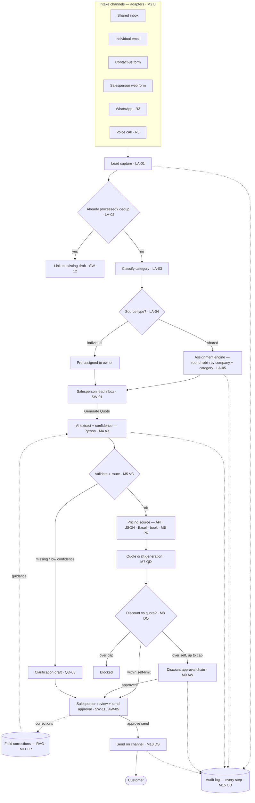
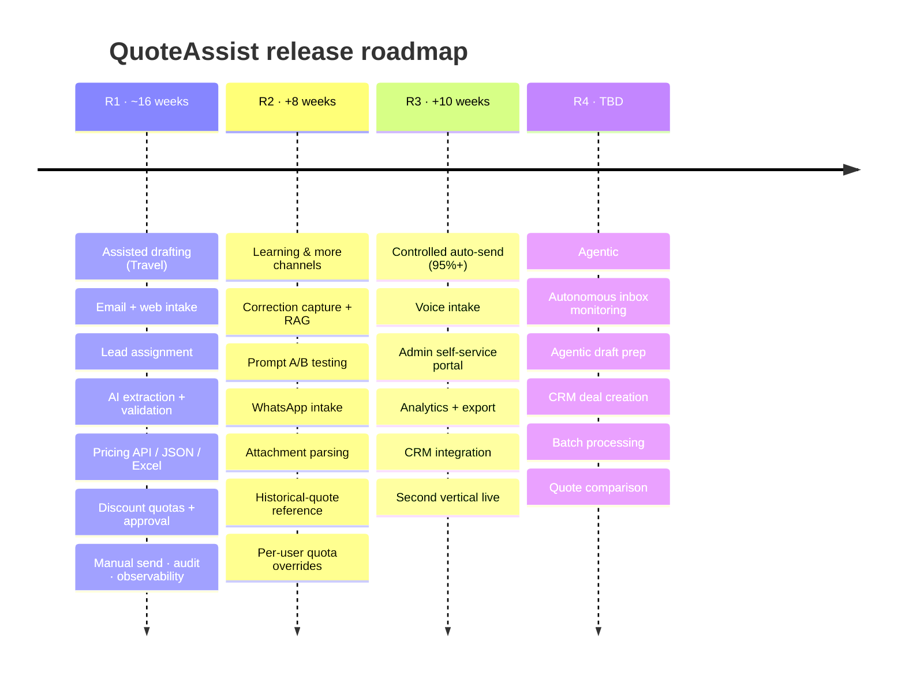
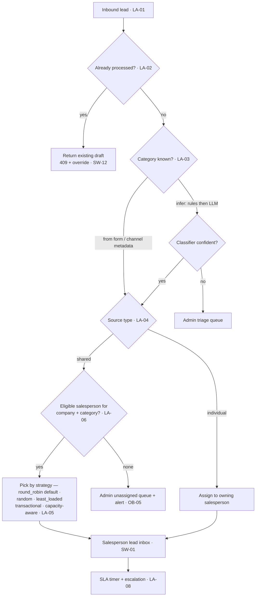
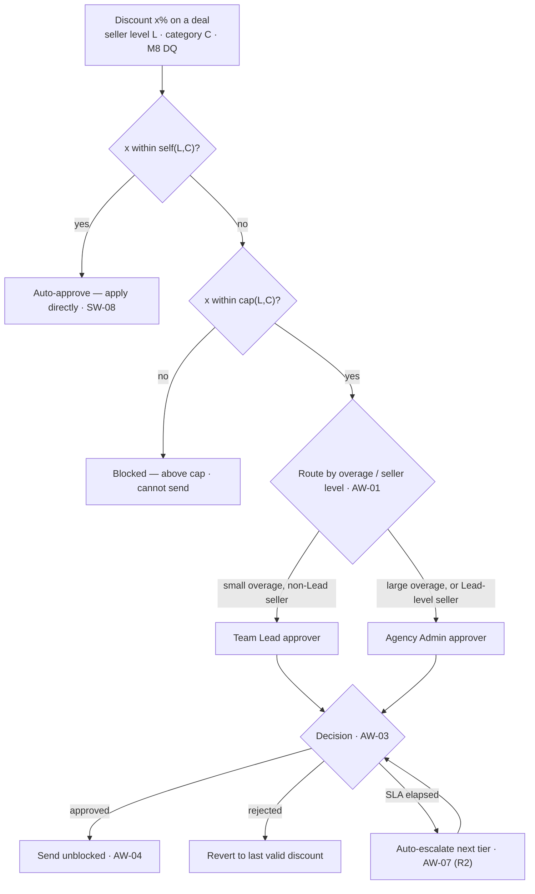
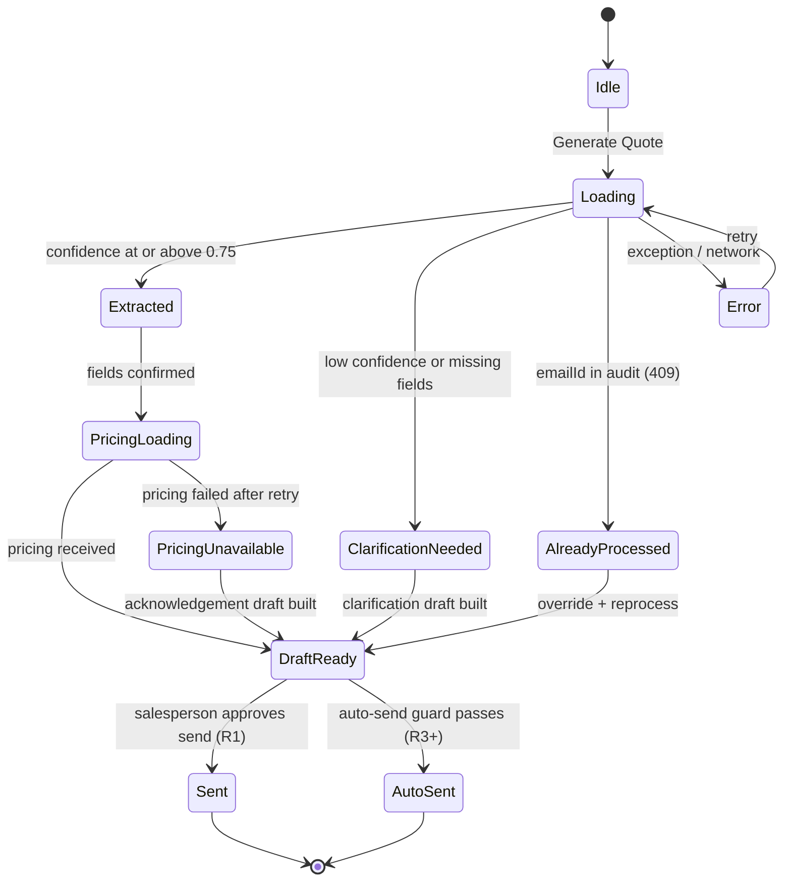
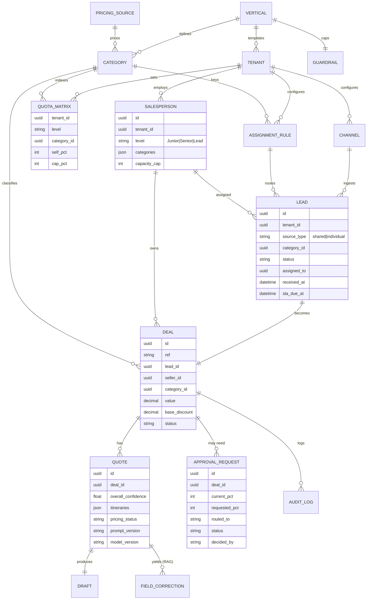
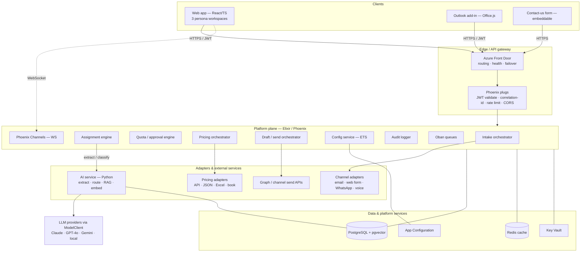
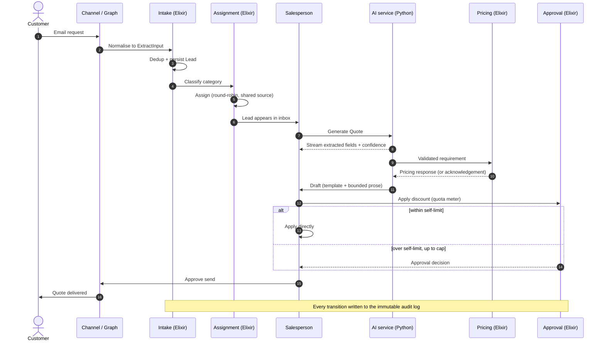

# QuoteAssist — Unified Requirements & Solution Design

### AI-Assisted, Multi-Tenant Lead-to-Quote Platform

---

| | |
|---|---|
| **Document** | Requirements & Solution Design (proposal-grade) |
| **Product** | QuoteAssist |
| **Version** | 1.0 (Unified) |
| **Date** | 13 June 2026 |
| **Status** | Draft — for client proposal, architecture and implementation sign-off |
| **Owner** | Product / Architecture |
| **Audience** | Client stakeholders · Solution Architect · Development Team Lead · QA · DevOps · Security |
| **Supersedes / merges** | *QuoteAssist — Requirements v2 (Multi-tenant platform)* and *AI Quote Generator for Travel Domain — Solution Design v1.0* |
| **v1 target** | Airline / Travel vertical end-to-end, on a multi-vertical, multi-tenant foundation |
| **Recommended stack** | Elixir/Phoenix platform services · Python AI/extraction service · Azure cloud |

---

## How to read this document

This is a single source of truth written for three audiences. Read the slices that apply to you:

| You are… | Read | Skip on first pass |
|---|---|---|
| **Client / business stakeholder** | §1 Executive Summary · §2 Vision & Goals · §3 Personas · §4 Lifecycle · §5 Scope & Releases · §15 Risks · §16 Acceptance · §17 Commercials | §7–§13 (architecture, data, AI internals) |
| **Solution Architect** | §4 Lifecycle · §6 Functional Requirements · §7 Data Model · §8 Architecture · §9 AI/ML Design · §10 Integrations · §11 NFRs · §12 Security | §17 Commercials |
| **Development Team Lead / QA** | §6 Functional Requirements · §7 Data Model · §13 Implementation Plan · §16 Acceptance Criteria · §18 Traceability | §1, §17 |

Every functional requirement carries a stable **ID**, a **priority** (P0/P1/P2), a **release** (R1–R4), **acceptance criteria**, and a **source trace** back to the two documents this merges (`[QA …]` = QuoteAssist v2; `[SD …]` = Solution Design; `[NEW]` = added in this synthesis to connect the two).

---

## Table of contents

1. [Executive Summary](#1-executive-summary)
2. [Product Vision & Goals](#2-product-vision--goals)
3. [Personas & Roles](#3-personas--roles)
4. [End-to-End Lifecycle (Lead → Quote → Send)](#4-end-to-end-lifecycle-lead--quote--send)
5. [Scope & Release Strategy](#5-scope--release-strategy)
6. [Functional Requirements](#6-functional-requirements)
7. [Data Model](#7-data-model)
8. [Solution Architecture](#8-solution-architecture)
9. [AI / ML Design](#9-ai--ml-design)
10. [Integration Requirements](#10-integration-requirements)
11. [Non-Functional Requirements](#11-non-functional-requirements)
12. [Security, Privacy & Compliance](#12-security-privacy--compliance)
13. [Phased Implementation Plan](#13-phased-implementation-plan)
14. [Environments, DevOps & Release Management](#14-environments-devops--release-management)
15. [Risks & Mitigations](#15-risks--mitigations)
16. [Acceptance Criteria](#16-acceptance-criteria)
17. [Commercials, Assumptions, Dependencies & Open Questions](#17-commercials-assumptions-dependencies--open-questions)
18. [Requirement Traceability Matrix](#18-requirement-traceability-matrix)
19. [Glossary](#19-glossary)
20. [Repository & Project Structure](#20-repository--project-structure)

---

## 1. Executive Summary

**The problem.** Every company that sells products or services fields a constant stream of quotation and lead requests. Those requests arrive through many doors — a shared sales inbox, an individual salesperson's email, a "Contact us" web form, WhatsApp, a phone call, or a form a salesperson fills in on the customer's behalf. Today, a human reads each one, works out what the customer actually wants, looks up pricing, drafts a reply, applies any discount within their authority (or chases an approval if it exceeds it), and finally sends. It is slow, inconsistent, hard to govern, and impossible to learn from at scale.

**The product.** QuoteAssist is a multi-tenant, multi-vertical platform that takes a lead from **any channel** to an **approved, sent quote** with a human always in control of what reaches the customer. It does three things that today are done by hand and disconnected:

1. **Captures and routes every lead.** All inbound requests — regardless of channel — land in one place, are de-duplicated, classified by category, and **assigned to the right salesperson**: auto-assigned by company + category when they come from a shared source, or kept with their owner when they arrive on an individual's channel.
2. **Understands the request and prices it.** A Python AI service reads the message, extracts the structured requirement (for Travel: origin, destination, dates, passengers, preferences), scores its own confidence, asks for clarification when unsure, then calls a **pricing source** — a live pricing API, or fixed pricing held in JSON/Excel/a managed price book — and maps the result into a quote.
3. **Drafts the reply and governs the send.** The system drafts a professional response on the original channel and holds it for the **salesperson's approval**. If the quote carries a discount above the salesperson's self-approve limit, it additionally routes through a **tiered discount-approval chain** before it can be sent. Nothing reaches the customer without a human decision.

**Why now / why this design.** The platform is **configuration-driven** (verticals, categories, schemas, prompts, pricing sources, quotas and approval chains are all configuration, not code), **multi-tenant from the first line of code**, and **built to learn** — every correction a salesperson makes to an AI extraction improves future extractions without retraining a model. It is delivered behind **adapter interfaces** for every external dependency (channel, AI provider, pricing source), so adding a channel or swapping a model is a contained change, not a rewrite.

**v1 (this proposal).** We build the complete flow end-to-end for the **Airline/Travel** vertical — the most detailed and highest-value example — on a foundation that already understands multiple verticals and tenants. Other verticals (Product/Wholesale, Medical, SaaS, Insurance, Automotive) become a configuration exercise in later releases, not a re-build. Auto-send remains **disabled** in v1: every customer-facing message is a human-approved draft.

**Headline targets (v1, Travel):**

| Outcome | Target |
|---|---|
| Lead → drafted quote (button click to draft visible) | **< 10 seconds** for a standard single-itinerary quote |
| AI extraction accuracy on clean requests | **> 92%** on the UAT test library |
| Clarification rate after 4 weeks of learning | **< 20%** |
| Agent time saved per quote | **> 8 minutes** |
| Blended AI cost per 1,000 quotes | **< $15** |
| Platform availability | **99.5%** (active-active, two Azure regions) |
| Customer-facing messages sent without human approval (v1) | **0** |

---

## 2. Product Vision & Goals

### 2.1 Vision statement

> *One platform where any company, in any sales vertical, turns an inbound request on any channel into an accurate, on-brand, policy-compliant quote in seconds — with AI doing the reading, pricing and drafting, and people doing the judging and the sending.*

### 2.2 Goals

| # | Goal | Why it matters |
|---|---|---|
| G1 | **Never lose or mis-route a lead.** Every inbound request is captured, de-duplicated, classified and assigned to an accountable owner. | Leakage and slow first-response are the biggest causes of lost deals. |
| G2 | **Collapse quote turnaround** from tens of minutes to seconds. | Speed-to-quote is a primary win driver. |
| G3 | **Make every quote policy-compliant by construction.** Discounts respect per-level, per-category quotas; over-limit discounts route for approval; hard guardrails can never be breached. | Protects margin and removes ad-hoc, ungoverned discounting. |
| G4 | **Keep a human in the loop by default.** All customer-facing output is a reviewable draft; auto-send is a separately-gated, later capability. | Trust, brand safety, and regulatory comfort. |
| G5 | **Learn continuously without retraining.** Capture every correction and feed it back as guidance to the AI. | Accuracy compounds; the system gets better the more it is used. |
| G6 | **Be vertical- and tenant-agnostic.** New verticals and new tenants are configuration. | One codebase serves many industries and many customers. |
| G7 | **Be observable, auditable and cost-controlled** end to end. | Operability, compliance, and predictable unit economics. |

### 2.3 Design principles

These are binding architectural constraints, not aspirations. Every requirement and review checks against them.

| Principle | What it means in practice |
|---|---|
| **Configuration-driven** | Verticals, categories, field schemas, thresholds, templates, prompt versions, AI model selection, pricing sources, quota matrices and approval chains live in configuration. A business change is a config update with full version history — never a code deploy. |
| **Human-in-the-loop by default** | All customer-facing messages are created as drafts. Auto-send is a separately-gated capability, **disabled in R1**. Salespeople always review before sending. |
| **Adapter pattern for all external dependencies** | Every channel (email, WhatsApp, voice, web), AI provider, and pricing source sits behind an adapter interface. Swapping or adding one is a module replacement, not a rewrite. |
| **One normalised pipeline** | All intake channels normalise to a single internal input contract before processing. Nothing downstream depends on the source channel. |
| **Learn from corrections** | Every salesperson edit to an AI-extracted field is stored as a correction pair and used as retrieval-augmented (RAG) guidance to improve future extractions without model retraining. |
| **Cost by design** | Requests are routed to the cheapest capable model; caching eliminates repeat AI calls; spend caps are enforced at the infrastructure level per tenant. |
| **Secure & isolated by design** | No secrets in code. Tenant isolation enforced at the data layer. Customer message bodies processed in memory; never persisted in full. |
| **Stable IDs, never labels** | Verticals, categories, levels and tenants are referenced by stable identifier so terminology can change without breaking data or routing. |

### 2.4 Success metrics (measured, not assumed)

Business and technical dashboards (§9, §11, §14) track these from day one of the pilot:

- **Volume & coverage:** leads captured per channel; % auto-assigned vs pre-assigned; unassigned-queue age.
- **Speed:** P50/P95 lead→draft latency; first-response time.
- **Quality:** extraction accuracy; clarification rate (7-day rolling); average confidence; missing-field frequency by field.
- **Governance:** % quotes within self-approve limit; approval cycle time; over-cap blocks; discount distribution by level/category.
- **Trust & learning:** correction frequency by field (should fall over time); auto-send adoption (R3+).
- **Economics:** blended AI cost per quote; cache hit rate; agent minutes saved per quote.

---

## 3. Personas & Roles

QuoteAssist has **three human personas**, each with their own workspace, plus system/service roles. The persona model is inherited from QuoteAssist v2 and extended with the lead-management and AI-review responsibilities introduced by this synthesis.

### 3.1 Site Administrator (platform operator) — `SA`
Operates the platform as a whole. Onboards tenants (companies), defines and maintains the vertical catalog and global discount guardrails, manages plans/billing, and watches cross-tenant usage and health. Exempt from tenant scoping (can see across tenants). *Source: [QA SA-\*].*

### 3.2 Company / Agency Admin (tenant operator) — `AG`
Operates one tenant. Configures the company's **intake channels** and **pricing sources**, manages **categories** and **salespeople** (and their levels), sets **discount quotas** and **approval chains**, defines **lead-assignment rules**, and clears the approval queue. Owns the tenant's quote quality and policy. *Source: [QA AG-\*, DQ-\*] + [NEW] intake/pricing/assignment config.*

> **Note:** "Agency" in QuoteAssist v2 and "Company" in the client brief are the same concept — a **tenant**. This document uses **Company/Agency Admin** and treats *tenant* as the technical term.

### 3.3 Salesperson (the agent) — `SW`
The front-line user. Receives assigned leads in a **lead inbox**, reviews and corrects the AI-extracted requirement, triggers/reviews pricing, reviews the drafted reply, applies a discount within their quota (or requests approval above it), and **approves the send**. *Source: [QA SD-\*] + [SD plugin states] + [NEW] lead inbox & draft review.*

### 3.4 Roles & permissions (RBAC)

Personas map to coarse workspaces; fine-grained capability is governed by roles attached to the authenticated identity (resolved from the JWT/Entra ID claims). Roles are additive and tenant-scoped (except platform roles).

| Role | Persona | Key permissions |
|---|---|---|
| `platform_admin` | Site Admin | All tenants; verticals; guardrails; plans; cross-tenant analytics. **Not** tenant-scoped. |
| `tenant_admin` | Company/Agency Admin | Manage own tenant: channels, pricing sources, categories, salespeople, quotas, approval chains, assignment rules, settings. |
| `approver` | Company/Agency Admin (or designated Lead) | Decide discount-approval and quote-send-approval requests routed to them. |
| `quote_generator` | Salesperson | Trigger extraction, generate quote, edit fields. |
| `quote_sender` | Salesperson | Approve and send the customer-facing draft. |
| `auto_send_approver` | Company/Agency Admin | Enable/disable auto-send (R3+); set thresholds. |
| `config_editor` | Company/Agency Admin / platform | Edit schemas, prompts, templates, model selection (no code deploy). |
| `audit_viewer` | Compliance / Admin | Read audit trail; export. |
| `config_reader` | Any admin | Read-only configuration view. |

*Source: [SD §7.1 roles] + [QA persona model], unified.*

---

## 4. End-to-End Lifecycle (Lead → Quote → Send)

This is the unifying flow. It joins the **intake/assignment** middle (the client brief), the **AI/pricing/draft** engine ([SD]), and the **quota/approval governance** ([QA]). Each numbered step maps to a functional module in §6.



**Narrative walkthrough (happy path, Travel):**

1. **Arrival (LI).** A customer emails the shared sales inbox asking for a Dubai trip. A channel adapter ingests it, strips HTML/signatures/threads, detects forwarding, and normalises it to one internal `ExtractInput` contract. *(Individual-channel arrivals, e.g. a salesperson's own inbox or a web form they submit, skip auto-assignment — see step 3.)*
2. **Capture & de-dup (LA).** The lead is persisted as a `Lead` record; the system checks whether this message was already processed and, if so, links to the existing work instead of duplicating it.
3. **Classify & assign (LA).** A lightweight classifier (or channel/form metadata) sets the **category**. Because this came from a **shared** source, the **assignment engine** picks an eligible salesperson for that company + category (round-robin by default; configurable), respecting capacity and availability. The lead appears in that salesperson's **lead inbox**. *(A lead from an individual source is already owned and skips this.)*
4. **Understand (AX).** The salesperson opens the lead and clicks **Generate Quote**. The Python AI service extracts structured fields (origin, destination, dates, passengers, preferences), returns **per-field confidence** and explanations, and streams fields as they arrive. Prior corrections for similar requests are injected as guidance (LR/RAG).
5. **Validate & route (VC).** Fields are normalised (dates, relative expressions), validated against the active schema, and scored. High confidence → proceed to pricing; missing/low → **clarification** path.
6. **Price (PR).** The validated requirement is mapped to a pricing request and sent to the configured **pricing source** for that category — a live API, or fixed JSON/Excel, or a managed price book. Partial/failed pricing degrades gracefully (acknowledgement path), never a blank screen.
7. **Draft (QD).** A professional reply is generated — deterministic template structure with an LLM-assisted prose summary — as a **draft** on the original channel (e.g. a threaded Outlook reply; a WhatsApp templated message; an email for a voice lead).
8. **Govern the discount (DQ + AW).** If the salesperson applies a discount, a **live quota meter** shows self/approval/blocked zones for their level and the deal's category. Within their self-approve limit → they may proceed. Above it but under the cap → a **discount-approval request** routes up the tiered chain. Above the cap → blocked.
9. **Approve & send (AW + DS).** The salesperson reviews the draft and **approves the send**. If a discount approval was required, the send is blocked until that approval lands. On approval, the message is sent on the customer's channel and the deal advances.
10. **Audit & learn (OB + LR).** Every step is logged immutably with a correlation ID. Any field the salesperson corrected before sending is captured to improve future extractions.

---

## 5. Scope & Release Strategy

### 5.1 In scope (v1 / Release 1)

- Multi-tenant, multi-vertical **foundation** with the Airline/Travel vertical fully configured.
- **Omni-channel intake** for v1: **Email** (primary, Outlook/Graph), **Contact-us web form**, and **salesperson web form**. *(WhatsApp and voice are adapter-ready but enabled in R2/R3 — see roadmap.)*
- **Lead capture, de-duplication, classification and assignment** (shared→auto-assign; individual→owner).
- **AI requirement extraction** with confidence, explainability, schema validation, and clarification routing.
- **Pricing** via a configurable source: REST pricing API **and** fixed JSON/Excel/price-book adapters.
- **Quote, clarification and acknowledgement draft generation**, threaded on the source channel.
- **Discount quotas** (level × category, self/cap) and **tiered discount-approval workflow**.
- **Salesperson send-approval** (human-in-the-loop); **auto-send disabled**.
- **Audit trail, observability, alerting**; **tenant-scoped auth (Entra ID)**.
- Three **persona workspaces** (Site Admin, Company/Agency Admin, Salesperson).

### 5.2 Out of scope for v1 (planned later — see roadmap)

Auto-send; WhatsApp/voice live channels; CRM integration; attachment/PDF parsing; historical-quote recommendation; agentic inbox monitoring; admin self-service portal for non-technical config authoring; batch processing; analytics export; non-Travel verticals in production use.

### 5.3 Release strategy

| Release | Theme | Scope highlights | Auto-send | Indicative timeline |
|---|---|---|---|---|
| **R1** | **Assisted drafting (Travel)** | Foundation + email/web intake, assignment, AI extraction, validation, pricing, quote/clarification drafts, discount quotas + approval workflow, manual send, audit, observability | **Disabled** | **~16 weeks** (see §13) |
| **R2** | **Learning & more channels** | Correction capture + RAG enrichment, prompt A/B testing, **WhatsApp intake**, attachment parsing (Azure Document Intelligence), historical-quote reference, per-user quota overrides, richer notifications (email/push) | **Disabled** | +8 weeks |
| **R3** | **Controlled auto-send & 2nd vertical** | Auto-send behind business gate (≥95% confidence), **voice intake**, admin self-service portal, analytics dashboard & export, CRM integration (Salesforce/HubSpot), a second vertical live (e.g. Product/Wholesale) | **Enabled (gated)** | +10 weeks |
| **R4** | **Agentic** | Autonomous inbox monitoring & draft preparation, CRM deal creation, batch processing, quote comparison/recommendation engine | **Full agent mode** | TBD after R3 baseline |

*Source: [SD §9 release strategy] extended with the intake/assignment/governance scope and the multi-vertical sequencing decided for this proposal.*




---

## 6. Functional Requirements

Requirements are grouped into **16 modules**. Each requirement uses the format:

> **`ID` · Title** — `Priority` · `Release` · `Maturity`
> Description. **AC:** acceptance criteria. **Trace:** source.

- **Priority:** `P0` must-have · `P1` should-have · `P2` could-have.
- **Release:** `R1`–`R4` per §5.3.
- **Maturity** (where a prototype already exists in QuoteAssist v2): `Built` · `Partial` · `Planned`. Items new to this synthesis are `Planned`.

**Module index:** [PF](#m1--platform-foundation--multi-tenancy-pf) · [LI](#m2--omni-channel-lead-intake-li) · [LA](#m3--lead-capture-de-duplication--assignment-la) · [AX](#m4--ai-requirement-capture--extraction-ax) · [VC](#m5--validation--confidence-engine-vc) · [PR](#m6--pricing-engine--sources-pr) · [QD](#m7--quote-drafting--generation-qd) · [DQ](#m8--discount-quotas-dq) · [AW](#m9--approval-workflows-aw) · [DS](#m10--delivery--send-ds) · [LR](#m11--learning--continuous-improvement-lr) · [SA](#m12--site-administrator-workspace-sa) · [AG](#m13--companyagency-admin-workspace-ag) · [SW](#m14--salesperson-workspace-sw) · [OB](#m15--observability-audit--notifications-ob) · [CC](#m16--cross-cutting-ux-auth--settings-cc)

---

### M1 · Platform Foundation & Multi-Tenancy (`PF`)

The shared multi-tenant, multi-vertical backbone every persona reads and writes through, plus the configuration entities that make the platform config-driven.

**`PF-01` · Vertical catalog** — `P0` · `R1` · `Built`
Define the set of industry verticals the platform supports, each with its own terminology and pricing/lead categories.
**AC:** 6 seed verticals (Airline, Product/Wholesale, Medical, SaaS, Insurance, Automotive); each stores display name, deal noun + plural, money unit, ordered list of categories; verticals referenced by stable id, never by label.
**Trace:** [QA PF-01].

**`PF-02` · Tenant (company/agency) entity** — `P0` · `R1` · `Built`
Model a company as a tenant bound to exactly one vertical, with plan, seat usage, status and billing.
**AC:** fields `name, vertical, plan, seatsUsed, status(active|trial|suspended), MRR, owner, region, created`; references exactly one vertical id; seat limit derived from plan.
**Trace:** [QA PF-02].

**`PF-03` · Seller levels** — `P0` · `R1` · `Built`
Three ordered seller levels that discount quotas attach to.
**AC:** `Junior < Senior < Lead`, ordered; every salesperson holds exactly one level.
**Trace:** [QA PF-03].

**`PF-04` · Categories (pricing + routing)** — `P0` · `R1` · `Built`
A vertical-defined product/price grouping. Categories are dual-purpose: they index discount quotas **and** drive lead assignment (§M3).
**AC:** categories belong to a vertical; referenced by stable id; each category may map to a pricing source (§M6) and a salesperson eligibility pool (§M3).
**Trace:** [QA glossary "Pricing category"] extended for routing [NEW].

**`PF-05` · Discount quota matrix** — `P0` · `R1` · `Built`
Per-tenant matrix of `{self, cap}` discount percentages indexed by level × category.
**AC:** seeded from the vertical's categories on tenant creation; `self ≤ cap` enforced at write time (raising self raises cap; lowering cap lowers self); both clamped to the vertical guardrail.
**Trace:** [QA PF-04].

**`PF-06` · Lead entity** — `P0` · `R1` · `Planned` *(new)*
The inbound request record, channel-agnostic, created at intake before assignment.
**AC:** fields `id, tenant, sourceChannel, sourceType(shared|individual), senderIdentity, conversationId, rawRef, category, status(new|assigned|in_progress|quoted|sent|closed|discarded), assignedTo, receivedAt, slaDueAt`; one Lead may yield one Deal.
**Trace:** [NEW] — the missing middle between [QA] and [SD].

**`PF-07` · Deal entity** — `P1` · `R1` · `Built`
A quote/opportunity owned by a salesperson, carrying value, category and a base discount; created from a Lead.
**AC:** fields `ref, leadId, customer, category, value, seller, baseDiscount, status`; category is one of the tenant vertical's categories.
**Trace:** [QA PF-05] linked to `PF-06`.

**`PF-08` · Quote entity** — `P0` · `R1` · `Planned`
The priced, drafted response to a Deal; multiple itineraries/line-items; holds extraction result, pricing result and draft state.
**AC:** references one Deal; stores overall confidence, itineraries/line-items, pricing status, draft reference, send state, expiry.
**Trace:** [SD `extracted_quotes` + `pricing_responses` + `email_drafts`], unified.

**`PF-09` · Approval request entity** — `P0` · `R1` · `Built`
A record created when a discount exceeds a seller's self-approve limit (and, in R3+, when a send needs sign-off).
**AC:** fields `tenant, deal, customer, category, value, seller, level, current%, requested%, routedTo, reason, status, timestamps, decidedBy, note`; lifecycle `pending → approved | rejected`.
**Trace:** [QA PF-06].

**`PF-10` · Versioned configuration store** — `P0` · `R1` · `Planned`
Field schemas, prompts, email/message templates, confidence thresholds, model-routing rules, pricing-source config and assignment rules are versioned config rows, not code.
**AC:** changing active config inserts a new version (no destructive update); `isActive` flag selects the live version; every config carries `tenantId` with fallback to `default`; the version used is logged on each request.
**Trace:** [SD §2.2, §3.2, §3.13, Tables 3 & 15].

**`PF-11` · Activity log** — `P1` · `R1` · `Built`
Append-only feed of request/decision/state events for audit and activity panels.
**AC:** every state change appends an entry (actor, deal/lead, %, timestamp); newest-first ordering.
**Trace:** [QA PF-07].

**`PF-12` · Server API, persistence & RBAC** — `P0` · `R1` · `Planned`
Authenticated, tenant-scoped REST/GraphQL endpoints replace the prototype's client-side store.
**AC:** all reads/writes scoped to the caller's tenant (platform admin exempt); role-based authorisation on every endpoint; optimistic concurrency on quota + approval writes; durable server persistence.
**Trace:** [QA PF-08, PF-09].

---

### M2 · Omni-Channel Lead Intake (`LI`)

Every channel normalises to one internal contract. Adding a channel is one adapter module; nothing downstream changes. *Source: [SD §3.6, Table 7] + [NEW] for shared/individual classification and web forms.*

**`LI-01` · Unified intake contract (`ExtractInput`)** — `P0` · `R1` · `Planned`
All adapters populate one struct before the pipeline.
**AC:** carries `rawText, senderIdentity, sourceChannel, sourceType(shared|individual), conversationId, receivedAt, attachmentCount, isForwarded, originalSenderIfForwarded, tenantId`; nothing downstream depends on the channel.
**Trace:** [SD §3.6].

**`LI-02` · Email intake adapter (Outlook/Graph)** — `P0` · `R1` · `Planned`
Ingest from a **shared sales mailbox** and from **individual salesperson mailboxes** via Microsoft Graph; plus an Outlook add-in surface for on-demand processing of a selected email.
**AC:** HTML strip, thread extraction (latest-email-only), signature removal, forwarded-email detection with original-sender extraction; shared mailbox → `sourceType=shared`, individual mailbox/add-in → `sourceType=individual`; threaded reply drafted back via Graph.
**Trace:** [SD Table 7 row 1, §3.x email processing, Phase 2 add-in].

**`LI-03` · Contact-us web form adapter** — `P0` · `R1` · `Planned`
A hosted/embeddable form posts structured + free-text requests into the platform.
**AC:** maps form fields → `ExtractInput`; `sourceType=shared` (unassigned); optional category pre-selected on the form; spam/abuse protection (captcha/rate-limit).
**Trace:** [NEW] (client brief "contact us").

**`LI-04` · Salesperson web form adapter** — `P0` · `R1` · `Planned`
A salesperson submits a request on the customer's behalf (e.g. captured by phone).
**AC:** `sourceType=individual`; lead is pre-assigned to the submitting salesperson; category captured directly.
**Trace:** [NEW] (client brief "directly with web form submit by sales person").

**`LI-05` · WhatsApp intake adapter** — `P1` · `R2` · `Planned`
Inbound WhatsApp messages via Meta Cloud API webhook.
**AC:** media strip, multi-message concatenation, sender identity; shared business number → `shared`; reply via approved WhatsApp Business template (§DS).
**Trace:** [SD Table 7 row 2, §4.10].

**`LI-06` · Voice-call intake adapter** — `P2` · `R3` · `Planned`
Inbound calls transcribed in real time (Twilio Media Streams + Deepgram/Azure STT).
**AC:** transcription, silence removal, speaker diarisation (customer lines only); on call end, transcript enters the pipeline as `rawText`; reply via SMS/email per preference.
**Trace:** [SD Table 7 row 3, §4.2].

**`LI-07` · Web-chat intake adapter (future)** — `P2` · `R4` · `Planned`
Multi-turn web widget sessions.
**AC:** session context + multi-turn merge + HTML sanitise; in-chat response plus email.
**Trace:** [SD Table 7 row 4].

**`LI-08` · Attachment awareness** — `P1` · `R1` · `Planned`
Detect attachments; full parsing deferred to R2.
**AC:** R1 flags presence with a non-blocking notice ("N attachment(s) not processed — review manually") and logs count + types; R2 parses PDFs via Azure Document Intelligence and merges extracted data.
**Trace:** [SD §3.12, §4.7].

---

### M3 · Lead Capture, De-duplication & Assignment (`LA`)

The synthesis module the client brief is built around: collect every lead, avoid duplicates, classify, and route to the right salesperson. *Source: [NEW] + [SD §3.9 dedup].*

**Assignment decision flow (the "missing middle"):**




**`LA-01` · Lead capture & persistence** — `P0` · `R1` · `Planned`
Persist every inbound `ExtractInput` as a `Lead` (PF-06) with full provenance.
**AC:** one Lead per inbound request; stores channel, sourceType, sender, tenant, receivedAt; visible in the appropriate queue immediately.
**Trace:** [NEW].

**`LA-02` · De-duplication & reprocessing guard** — `P0` · `R1` · `Planned`
Before processing, check whether this message/conversation was already handled.
**AC:** dedup query on `email_id`/`conversationId` against prior `DRAFT_CREATED|SENT` actions; on match return a clear "already processed" state with a link to the existing Deal/draft (HTTP 409 with `existingRequestId, draftId, processedAt`); reprocessing allowed only via explicit `overrideDedup` (e.g. customer amended the request).
**Trace:** [SD §3.9].

**`LA-03` · Category classification** — `P0` · `R1` · `Planned`
Determine the lead's category to drive assignment and pricing.
**AC:** category taken from explicit channel/form metadata when present; otherwise inferred by a lightweight classifier (rules first, LLM fallback) against the tenant vertical's categories; low-confidence classification routes to an Admin triage queue rather than guessing.
**Trace:** [NEW] (client brief "filter by category").

**`LA-04` · Source-type routing (shared vs individual)** — `P0` · `R1` · `Planned`
Decide whether a lead needs auto-assignment.
**AC:** `sourceType=shared` → enters the assignment engine (LA-05); `sourceType=individual` → pre-assigned to its owning salesperson, skips auto-assignment but still de-duplicated and classified.
**Trace:** [NEW] (client brief "if it's came on shared source otherwise it is already assign").

**`LA-05` · Assignment engine** — `P0` · `R1` · `Planned`
Auto-assign a shared lead to an eligible salesperson for the company + category.
**AC:** eligibility = salespeople in the tenant who handle the lead's category and are available (not out-of-office, under capacity cap); **strategy is configurable** — `round_robin` (default), `random`, or `least_loaded`; assignment is atomic (no double-assignment under concurrency); if no eligible salesperson, lead lands in the **Admin unassigned queue** and raises an alert; every assignment is logged with the strategy and the candidate pool size.
**Trace:** [NEW] (client brief "assign to any random sales person … filter by category").

**`LA-06` · Assignment rules configuration** — `P0` · `R1` · `Planned`
Company/Agency Admin defines who is eligible and how leads are distributed.
**AC:** per category: eligible salesperson pool (by level/skill/explicit list), strategy, per-person daily/active caps, business-hours/out-of-office handling, and a fallback approver/queue; changes are versioned config (PF-10).
**Trace:** [NEW].

**`LA-07` · Manual (re)assignment & claim** — `P1` · `R1` · `Planned`
Admins reassign; salespeople may claim from a shared pool where configured.
**AC:** Admin can reassign any lead with reason logged; optional "claim" mode lets eligible salespeople pull from an unassigned pool; reassignment notifies both parties.
**Trace:** [NEW] (relates to [QA AG approval queue]).

**`LA-08` · Lead SLA timers & escalation** — `P1` · `R1` · `Planned`
Track first-response and action SLAs on leads.
**AC:** configurable SLA per category/source; unassigned or un-actioned leads past SLA escalate to Admin and notify; SLA breaches are a tracked metric.
**Trace:** [NEW] (mirrors [QA AP-07 auto-escalation] pattern).

---

### M4 · AI Requirement Capture & Extraction (`AX`)

The Python AI service that reads a request and produces a structured, confidence-scored requirement. *Source: [SD §3.2, §3.5, §3.8, Phase 5, Tables 5/13].*

**`AX-01` · Extraction service (Python)** — `P0` · `R1` · `Planned`
A standalone Python service exposes `extract(prompt, input) → ExtractionResult` behind a stable contract; the Elixir platform calls it.
**AC:** accepts normalised `ExtractInput`; returns structured fields, per-field confidence, missing/ambiguous field lists, `promptVersion`, `aiProvider`, `modelVersion`; JSON-schema-validated output; temperature 0; bounded `max_tokens`.
**Trace:** [SD §3.8 ModelClient, Phase 5.1/5.3] — language set to Python per client direction.

**`AX-02` · Prompt template loader & versioning** — `P0` · `R1` · `Planned`
Prompts are versioned config; the active one is composed with placeholders.
**AC:** substitute `emailSubject, emailBody, schemaVersion, requiredFields, optionalFields, fewShotExamples`; `promptVersion` returned and logged; changing the active prompt inserts a new version (no destructive update); A/B routing of a configurable % to a candidate prompt.
**Trace:** [SD §3.2 prompt versioning, Phase 5.2].

**`AX-03` · Schema-validated parsing** — `P0` · `R1` · `Planned`
LLM output is parsed and validated before anything downstream uses it.
**AC:** validate against the active extraction schema; on failure log a truncated raw response and return `SCHEMA_ERROR`; never pass an unvalidated response downstream.
**Trace:** [SD Phase 5.3].

**`AX-04` · Multi-item (itinerary/line-item) handling** — `P0` · `R1` · `Planned`
Assign stable ids to each extracted item so pricing can be matched back.
**AC:** each item gets `ITN-{requestShort}-{seq}`; multi-item requests preserved as a list; ids flow through pricing and back.
**Trace:** [SD Phase 5.4].

**`AX-05` · Model routing by complexity** — `P0` · `R1` · `Planned`
Route each request to the cheapest capable model.
**AC:** simple/short → cheapest tier (e.g. Claude Haiku); standard → mid tier (Claude Sonnet); complex/ambiguous/non-English/edge → top tier (GPT-4o); cache hit → no AI call; routing rule is config; provider+model logged per call.
**Trace:** [SD §3.1, Table 5].

**`AX-06` · Switchable models & fallback chain** — `P0` · `R1` · `Planned`
Swapping the active model is a config change; failures fall back automatically.
**AC:** every call goes through a `ModelClient` adapter; active model set in config with hot reload; fallback chain primary → secondary → local on 5xx/timeout; fallback rate tracked, alert > 5%.
**Trace:** [SD §3.8, Phase 5.6, Table 13].

**`AX-07` · AI concurrency queue & streaming** — `P0` · `R1` · `Planned`
Bound concurrent AI calls; stream progress to the UI.
**AC:** max N concurrent AI calls (default 5) via durable queue; additional requests queue (not dropped); status pollable; extraction tokens/fields streamed to the workspace via WebSocket so the user sees fields populate live.
**Trace:** [SD §3.5 speed, Phase 5.5].

**`AX-08` · Cost guardrails & token budgeting** — `P0` · `R1` · `Planned`
Prevent runaway spend.
**AC:** per-tenant daily spend cap (hard); token estimate with truncation above budget; token usage logged per request for billing; monthly alert at 80% of budget.
**Trace:** [SD §3.1 cost guardrails, Phase 4.5].

---

### M5 · Validation & Confidence Engine (`VC`)

Turns a raw extraction into a routing decision: quote, clarify, or acknowledge. *Source: [SD Phase 6].*

**`VC-01` · Mandatory-field validation** — `P0` · `R1` · `Planned`
Validate each item against the active schema's required fields.
**AC:** for Travel — `from`/`to` non-empty, `checkInDate`/`checkOutDate` valid ISO-8601 and check-out strictly after check-in, passenger count positive when required; produce a `ValidationResult` listing `{field, reason, rawValue}`.
**Trace:** [SD Phase 6.1].

**`VC-02` · Date & relative-expression normalisation** — `P0` · `R1` · `Planned`
Normalise human dates before validation.
**AC:** convert `10 June`, `June 10`, `10/06`, `10-06-2026` → ISO-8601; resolve relative expressions (`next Monday`, `this weekend`) against `receivedAt`; log original→normalised.
**Trace:** [SD Phase 6.2].

**`VC-03` · Confidence score calculator** — `P0` · `R1` · `Planned`
Compute an overall confidence with an auditable breakdown.
**AC:** weighted formula (mandatory completeness 0.40 + avg field confidence 0.30 + date/location validation 0.20 + pricing readiness 0.10); store full breakdown as JSON, not just the scalar.
**Trace:** [SD Phase 6.3].

**`VC-04` · Duplicate-item detection** — `P1` · `R1` · `Planned`
Collapse duplicate items within one request.
**AC:** hash `(from+to+checkIn+checkOut)`; flag and remove duplicates; record in ambiguous fields with explanation.
**Trace:** [SD Phase 6.4].

**`VC-05` · Decision router** — `P0` · `R1` · `Planned`
Decide the outcome path.
**AC:** missing mandatory/validation errors → `CLARIFICATION`; confidence ≥ autoSendThreshold AND autoSendEnabled → quote (auto-send eligible, R3+); confidence ≥ manualReviewThreshold → quote draft only; below → `CLARIFICATION`; return `{emailType, reason}`.
**Trace:** [SD Phase 6.5].

---

### M6 · Pricing Engine & Sources (`PR`)

Maps a validated requirement to a price, from any configured source. *Source: [SD Phase 7] + [NEW] fixed JSON/Excel/price-book per client brief.*

**`PR-01` · Pricing source abstraction (adapter)** — `P0` · `R1` · `Planned`
All pricing-source specifics sit behind `get_quote(PricingRequest) → PricingResponse`.
**AC:** nothing outside the adapter knows the source contract; source selected by category/vertical config; swapping a source is a module/config change.
**Trace:** [SD Phase 7.1].

**`PR-02` · REST pricing-API adapter** — `P0` · `R1` · `Planned`
Call a live external pricing API.
**AC:** configurable URL/auth/schema per tenant; payload built from validated requirement with config defaults (e.g. hotel category, currency); item ids included for matching; response mapped to internal model.
**Trace:** [SD Phase 7.1/7.2].

**`PR-03` · Fixed pricing adapters (JSON / Excel / price-book)** — `P0` · `R1` · `Planned`
Price from uploaded/managed fixed data when no API exists.
**AC:** Admin uploads a JSON or Excel price file, or maintains an in-app price book; adapter resolves price by category + key attributes; versioned with effective dates; validation on upload (schema, required columns); same `PricingResponse` shape as the API adapter.
**Trace:** [NEW] (client brief "any fixed pricing data in json or excel").

**`PR-04` · Resilience: retry, timeout, circuit breaker** — `P0` · `R1` · `Planned`
External pricing must fail safe.
**AC:** configurable timeout; retry with exponential backoff; circuit breaker opens after N consecutive failures, half-open probe on recovery; every retry/trip logged; circuit state is a monitored gauge.
**Trace:** [SD Phase 7.3, §3.4].

**`PR-05` · Graceful degradation (acknowledgement path)** — `P0` · `R1` · `Planned`
Never leave the salesperson with a blank screen.
**AC:** if pricing unavailable after retries → `pricingStatus=UNAVAILABLE`, route to acknowledgement draft (never auto-send), fire alert, still create a draft.
**Trace:** [SD Phase 7.4].

**`PR-06` · Partial-pricing handling** — `P1` · `R1` · `Planned`
Some items priced, others not.
**AC:** generate the quote with available prices; inject a visible warning for missing segments; `pricingStatus=PARTIAL`; suppress auto-send regardless of confidence.
**Trace:** [SD Phase 7.5].

**`PR-07` · Pricing cache** — `P1` · `R1` · `Planned`
Cache pricing responses separately from extraction.
**AC:** short TTL (default 10 min) keyed on the pricing request; cache hits logged for effectiveness reporting.
**Trace:** [SD §3.3].

---

### M7 · Quote Drafting & Generation (`QD`)

Produces the customer-facing draft — quote, clarification, or acknowledgement — on the source channel. *Source: [SD Phase 8].*

**`QD-01` · Template engine (deterministic structure)** — `P0` · `R1` · `Planned`
Structure comes from versioned templates; values substituted deterministically.
**AC:** `{{placeholder}}` substitution from quote + pricing data; itinerary/line-item details, pricing, dates, validity and signature are deterministic (no LLM); per-tenant, per-language templates.
**Trace:** [SD Phase 8.1].

**`QD-02` · LLM-assisted prose (bounded)** — `P1` · `R1` · `Planned`
Only the conversational summary paragraph is LLM-generated.
**AC:** LLM (temperature ~0.3) writes only the prose between greeting and the structured table; given tone instructions + data; the LLM never generates the full message; prose must not leak prompt instructions.
**Trace:** [SD Phase 8.2].

**`QD-03` · Clarification draft with dynamic field list** — `P0` · `R1` · `Planned`
Ask the customer only for what is actually missing.
**AC:** human-readable labels from schema config (e.g. `checkInDate → "Check-in date"`); bullet list from `missingFields`; multi-language via tenant label maps.
**Trace:** [SD Phase 8.3].

**`QD-04` · Acknowledgement draft** — `P1` · `R1` · `Planned`
Holding reply when pricing is unavailable.
**AC:** substitutes customer name (or "Valued Customer"), received time, SLA hours (config default 4h); always a draft, never auto-sent.
**Trace:** [SD Phase 8.4].

**`QD-05` · Quote validity / expiry flag** — `P2` · `R1` · `Planned`
Track and surface quote expiry.
**AC:** compute `expiryAt = sentAt + validityHours` (from pricing or config default 48h); store on the draft; on send, set a follow-up reminder on the source channel where supported (e.g. Outlook flag).
**Trace:** [SD Phase 8.5].

**`QD-06` · Channel-appropriate rendering** — `P0` · `R1` · `Planned`
The same quote renders correctly per channel.
**AC:** email → threaded HTML reply; WhatsApp → approved template with variables (R2); voice lead → SMS/email; rendering selected by the source channel without changing the quote model.
**Trace:** [SD Table 7 reply column] [NEW].

---

### M8 · Discount Quotas (`DQ`)

How a Company/Agency Admin defines what each seller level may discount per category — the policy engine. *Source: [QA DQ-\*].*

**`DQ-01` · Quota matrix editor** — `P0` · `R1` · `Built`
Editable level × category grid of self/cap percentages.
**AC:** rows = levels, columns = categories; each cell has self and cap inputs; inputs clamp to guardrail; self/cap invariant enforced on edit; legend explains the three zones.
**Trace:** [QA DQ-01].

**`DQ-02` · By-level card layout (alt view)** — `P1` · `R1` · `Built`
Alternative layout: one card per level with stepper controls per category, editing the same underlying matrix.
**AC:** stepper +/- and direct entry; both views reflect the same saved values.
**Trace:** [QA DQ-02, DQ-03].

**`DQ-03` · Guardrail enforcement** — `P0` · `R1` · `Built`
No quota input may exceed the platform guardrail for the tenant's vertical.
**AC:** values above the ceiling clamped on entry; ceiling shown in the page intro.
**Trace:** [QA DQ-04].

**`DQ-04` · Per-user quota override** — `P2` · `R2` · `Planned`
Override a specific salesperson's quota above their level default.
**AC:** per seller, per category; falls back to level default when unset; clearly badged as an override.
**Trace:** [QA DQ-05].

---

### M9 · Approval Workflows (`AW`)

Two governance gates, unified: **discount approval** (over-limit discounts) and **send approval** (human-in-the-loop). *Source: [QA AP-\*] + [SD human-in-the-loop / auto-send guard].*

**Discount routing & approval logic:**




**`AW-01` · Tiered discount-routing rule** — `P0` · `R1` · `Built`
Decide auto-approve / route / block and choose the approver tier by overage.
**AC:** `≤ self → auto`; `self < x ≤ cap → pending`; `> cap → blocked`; within the approval band, smaller overage → Team Lead, larger → Company/Agency Admin; Lead-level sellers always route to Admin.
**Trace:** [QA AP-01].

**`AW-02` · Approvals inbox** — `P0` · `R1` · `Built`
Manager queue of pending requests with full context.
**AC:** each card shows seller, level, deal, category, value, current→requested %, reason, routedTo, age; a meter shows where the request sits vs self/cap; Pending and Decided tabs with counts.
**Trace:** [QA AP-02].

**`AW-03` · Approve / reject with note** — `P0` · `R1` · `Built`
Manager decides, optionally attaching a note.
**AC:** approve/reject per card; optional note stored and shown to the seller; decision moves the card to Decided and updates counts.
**Trace:** [QA AP-03].

**`AW-04` · Send-block on pending discount** — `P1` · `R1` · `Planned`
A deal with a pending over-limit discount cannot be sent until approved.
**AC:** send disabled while `status=pending`; approval unblocks send; rejection reverts to the last valid discount.
**Trace:** [QA AP-04].

**`AW-05` · Salesperson send approval (human-in-the-loop)** — `P0` · `R1` · `Planned`
Every customer-facing message requires an explicit human send action in R1.
**AC:** drafts are never auto-sent in R1; the salesperson must review and click Send; the send action is audited with actor + timestamp.
**Trace:** [SD §2.2 principle, Table 30] [NEW unification].

**`AW-06` · Auto-send guard (R3+)** — `P1` · `R3` · `Planned`
When auto-send is later enabled, it is gated by simultaneous safety conditions.
**AC:** auto-send only if `autoSendEnabled` AND confidence ≥ threshold (≥95%) AND all mandatory fields present AND `pricingStatus=success` AND no validation errors AND no ambiguous fields; any failure keeps it a draft and logs `autoSendBlockedReason`.
**Trace:** [SD Phase 9.3].

**`AW-07` · Auto-escalation on stale approvals** — `P2` · `R2` · `Planned`
Escalate a pending request after an SLA window.
**AC:** configurable SLA per tier; stale request re-routes upward and notifies.
**Trace:** [QA AP-07].

---

### M10 · Delivery & Send (`DS`)

Creates and sends the approved message on the customer's channel. *Source: [SD Phase 9].*

**`DS-01` · Email draft & threaded send (Graph)** — `P0` · `R1` · `Planned`
Create a draft as a threaded reply to the original email and send on approval.
**AC:** `createReply` against the original message id so the draft sits in the thread; confirm draft accessible; send via Graph on approval; store draft id and send state.
**Trace:** [SD Phase 9.1/9.4].

**`DS-02` · On-Behalf-Of token exchange** — `P0` · `R1` · `Planned`
Send as the agent using delegated Graph access.
**AC:** OBO exchange of the user token for a delegated Graph token, in-memory for the request only; never logged or stored.
**Trace:** [SD Phase 9.2, §7.1].

**`DS-03` · WhatsApp / SMS / channel send adapters** — `P1` · `R2`/`R3` · `Planned`
Send on non-email channels behind adapters.
**AC:** WhatsApp via approved Business templates (R2); SMS/email for voice leads (R3); same approved-draft → send flow; per-channel delivery status captured.
**Trace:** [SD §4.10, Table 7] [NEW].

**`DS-04` · Recall / safety window (R2+)** — `P2` · `R2` · `Planned`
A short recall window after send where supported.
**AC:** configurable window; recall via channel API where available; recall events audited.
**Trace:** [SD Table 30 mitigation].

---

### M11 · Learning & Continuous Improvement (`LR`)

The system gets better with use, without retraining. *Source: [SD §3.2, Phase 9.5].*

**`LR-01` · Correction capture** — `P0` · `R2` · `Planned`
Store every field a salesperson corrects before an approved send.
**AC:** on confirmed send, for each changed field store `requestId, fieldName, originalAiValue, agentCorrectedValue, emailVector(embedding), promptVersion`; captured only on confirmed sends (not discarded drafts).
**Trace:** [SD §3.2, Phase 9.5].

**`LR-02` · RAG enrichment** — `P0` · `R2` · `Planned`
Inject similar past corrections as few-shot guidance.
**AC:** embed incoming cleaned text; vector-similarity search top 3–5 corrections above 0.75 similarity; prepend as few-shot examples to the extraction prompt; skip when too few corrections exist (insufficient signal).
**Trace:** [SD §3.2 RAG flow, Phase 5.7].

**`LR-03` · Prompt A/B testing & promotion** — `P1` · `R2` · `Planned`
Compare a candidate prompt before full rollout.
**AC:** route a configurable % to a candidate prompt; compare clarification rate and confidence; promote by activating the new version; full history preserved.
**Trace:** [SD §3.2 A/B].

**`LR-04` · Historical-quote reference** — `P2` · `R2`/`R3` · `Planned`
Surface a prior successful quote for a matching request.
**AC:** vector similarity on `(origin, destination, dateRange, passengerCount)`; salesperson can accept, adjust, or price fresh; reduces pricing calls for common routes.
**Trace:** [SD §4.3].

---

### M12 · Site Administrator Workspace (`SA`)

Cross-tenant operation. *Source: [QA SA-\*].*

**`SA-01` · Platform overview dashboard** — `P1` · `R1` · `Built`
At-a-glance KPIs and mix across all tenants. **AC:** agency count, seats in use, verticals live, MRR; agencies-by-vertical chart and plan mix; recent agencies with status. **Trace:** [QA SA-01].

**`SA-02` · Tenants list** — `P0` · `R1` · `Built`
Searchable/filterable/sortable list of every tenant. **AC:** filter by vertical/plan/status/seats; sort by name/seats/MRR; search by name/owner; pagination. **Trace:** [QA SA-02].

**`SA-03` · Create tenant** — `P0` · `R1` · `Built`
Onboard a new company. **AC:** capture name, owner, vertical, region, plan, status; seat limit follows plan; quota matrix auto-seeds; appears immediately. **Trace:** [QA SA-03].

**`SA-04` · Edit tenant** — `P1` · `R1` · `Built`
Change plan/vertical/region/owner/status. **AC:** plan change updates seat limit; status active restores MRR, suspended/trial zero it. **Trace:** [QA SA-04].

**`SA-05` · Suspend / reactivate / remove tenant** — `P1`/`P2` · `R1` · `Built`
Lifecycle controls. **AC:** suspend sets status+MRR=0; reactivate restores; remove requires explicit confirm modal; toasts shown. **Trace:** [QA SA-05, SA-06].

**`SA-06` · Verticals management** — `P1` · `R1` · `Partial`
View/edit the verticals catalog. **AC:** list verticals with deal noun, unit, categories, tenant count; edit terminology + categories; **pending:** persist category edits and re-seed affected quotas. **Trace:** [QA SA-07].

**`SA-07` · Global discount guardrails** — `P0` · `R1` · `Built`
Hard ceiling per vertical that no tenant quota may exceed. **AC:** slider 5–50% per vertical; saved guardrails clamp all tenant inputs for that vertical. **Trace:** [QA SA-08].

**`SA-08` · Plans & billing** — `P2` · `R1`/`R3` · `Partial`
Plan tiers, seat limits, pricing, adoption. **AC:** show plans with seats/price/features/agency count; **pending:** editable plans + real billing integration (R3). **Trace:** [QA SA-09].

**`SA-09` · Cross-tenant analytics** — `P2` · `R3` · `Planned`
Usage, approval volume, discount trends over time. **AC:** time-series of approvals, discount averages, active seats; filter by vertical and date range. **Trace:** [QA SA-10].

---

### M13 · Company/Agency Admin Workspace (`AG`)

Tenant operation: quotas, people, channels, pricing sources, assignment, approvals. *Source: [QA AG-\*] + [NEW] config surfaces.*

**`AG-01` · Agency overview dashboard** — `P1` · `R1` · `Built`
Pending approvals, KPIs, live activity. **AC:** KPIs (pending approvals, open deals + pipeline value, salespeople, decisions 30d); "waiting on you" links into the queue; activity feed. **Trace:** [QA AG-01].

**`AG-02` · Salespeople list & levels** — `P0` · `R1` · `Built`
Manage sellers and their levels. **AC:** search/filter/sort; per-level summary cards (self/cap ranges, headcount); change level updates quota instantly. **Trace:** [QA AG-02, AG-03].

**`AG-03` · Add salesperson** — `P1` · `R1` · `Planned`
Invite/create a seller at a chosen level. **AC:** capture name, email, level; appears with zero deals. **Trace:** [QA AG-04].

**`AG-04` · Intake channel configuration** — `P0` · `R1` · `Planned` *(new)*
Configure the tenant's channels. **AC:** connect shared mailbox(es), individual mailboxes, contact-us form, (R2) WhatsApp number, (R3) voice line; set per-channel `sourceType` and default category; test-connection per channel; versioned config. **Trace:** [NEW] + [SD Table 7].

**`AG-05` · Pricing source configuration** — `P0` · `R1` · `Planned` *(new)*
Bind categories to pricing sources. **AC:** per category choose REST API (URL/auth/schema) or upload JSON/Excel or maintain a price book; validate on save; effective-dated versions. **Trace:** [NEW] + [SD Phase 7].

**`AG-06` · Assignment rules configuration** — `P0` · `R1` · `Planned` *(new)*
Define lead-routing per category. **AC:** see `LA-06`. **Trace:** [NEW].

**`AG-07` · Approval-chain configuration** — `P1` · `R1` · `Planned`
Define tiers and approvers. **AC:** map overage bands → approver tier; set SLA per tier (for AW-07); choose designated Lead approvers. **Trace:** [QA AP-01 made configurable] [NEW].

**`AG-08` · Agency settings** — `P2` · `R1` · `Partial`
Profile, appearance, preferences. **AC:** reuse shared Settings; **pending:** agency-specific fields (logo, default approver). **Trace:** [QA AG-05].

---

### M14 · Salesperson Workspace (`SW`)

The front-line surface: lead inbox, AI review, pricing, discount, draft review, send. *Source: [QA SD-\*] + [SD plugin states] + [NEW] lead inbox.*

**Salesperson workspace / Outlook add-in state machine (SW-02):**




**`SW-01` · Lead inbox** — `P0` · `R1` · `Planned` *(new)*
The salesperson's queue of assigned leads. **AC:** lists assigned leads with channel, customer, category, age/SLA, status; sort/filter; opening a lead shows the original request + provenance. **Trace:** [NEW].

**`SW-02` · Generate-quote action & state machine** — `P0` · `R1` · `Planned`
A clear, unambiguous processing flow with defined states. **AC:** states — `idle, loading, extracted, clarification_needed, pricing_loading, draft_ready, pricing_unavailable, already_processed, error` (+ `auto_sent` in R3); each state has defined entry condition and UI; no ambiguous loading states. **Trace:** [SD §3.10, Table 10, Phase 2.6].

**`SW-03` · Extracted-field review & edit** — `P0` · `R1` · `Planned`
Review and correct the AI's extraction before pricing. **AC:** editable field form; the salesperson can edit any field; edits feed correction capture (LR-01) on confirmed send. **Trace:** [SD AC-14, Phase 9.5].

**`SW-04` · Confidence badge with explainability** — `P0` · `R1` · `Planned`
Show how confident the AI is and why. **AC:** green ≥90%, amber 75–89%, red <75% with labels; per-field explanations from ambiguous fields (e.g. "Passenger count interpreted as 2 from 'couple' — please verify"). **Trace:** [SD Phase 2.8, AC-07].

**`SW-05` · Deal picker & context** — `P1` · `R1` · `Built`
Choose a deal and see its category, value and the seller's level. **AC:** dropdown of the seller's deals; category, value, level shown on selection. **Trace:** [QA SD-01].

**`SW-06` · Discount input + slider + live quota meter** — `P0` · `R1` · `Built`
Apply a discount with a live quota check. **AC:** number + slider stay in sync; net value/saving update live; value clamped to guardrail; three-zone meter (green self / amber approval / red blocked) with self/cap labels and a fill marker. **Trace:** [QA SD-02, SD-03].

**`SW-07` · Outcome banner** — `P0` · `R1` · `Built`
Plain-language verdict for the current discount. **AC:** within-limit (apply now) / approval-needed (names approver) / blocked-above-cap; banner + primary action update together. **Trace:** [QA SD-04].

**`SW-08` · Apply within-limit discount** — `P1` · `R1` · `Built`
Apply directly when within quota. **AC:** writes `baseDiscount`; confirmation toast. **Trace:** [QA SD-05].

**`SW-09` · Request-approval modal** — `P0` · `R1` · `Built`
Submit an over-limit discount for approval. **AC:** shows routedTo, customer, current→requested %; reason required; creates a pending request visible to the Admin inbox + feed. **Trace:** [QA SD-06].

**`SW-10` · My requests panel** — `P1` · `R1` · `Built`
The salesperson's own request history. **AC:** lists pending/approved/rejected with status pill, current→requested %, decision note; updates immediately. **Trace:** [QA SD-07].

**`SW-11` · Draft review & send approval** — `P0` · `R1` · `Planned`
Review the generated draft and approve the send. **AC:** quote preview + open/edit; send disabled while a discount approval is pending (AW-04); explicit Send action sends on the channel (DS) and advances the deal; **never auto-sends in R1**. **Trace:** [SD Table 10 draft_ready, AW-05] [NEW].

**`SW-12` · Already-processed handling** — `P1` · `R1` · `Planned`
Avoid duplicate work. **AC:** if the lead/email was already processed, show an "already processed" card with a link to the existing draft and an override option. **Trace:** [SD §3.9, Table 10].

---

### M15 · Observability, Audit & Notifications (`OB`)

Operability, compliance and communication. *Source: [SD Phase 10/11] + [QA AP-05/06, PF-07].*

**`OB-01` · Immutable audit trail** — `P0` · `R1` · `Planned`
Log every significant event with full context and correlation id. **AC:** capture lead/request/deal id, correlation id, actor, tenant, action, prompt/model/provider, confidence + breakdown, pricing status, draft id, auto-send + blocked reason, timestamps; append-only; queryable via API with `audit_viewer` role; covers actions `LEAD_CAPTURED, ASSIGNED, EXTRACTION_*, VALIDATION_*, PRICING_*, DRAFT_CREATED, APPROVAL_REQUESTED, APPROVED, REJECTED, SENT, AUTO_SEND_BLOCKED, DUPLICATE_SKIPPED`. **Trace:** [SD Phase 10, AC-13] + [QA AP-06].

**`OB-02` · Data masking in logs** — `P0` · `R1` · `Planned`
Protect PII in the audit store. **AC:** never log full message body; mask customer name to initials, phone to last 4, email to first-2+domain; unmasked storage requires per-tenant compliance approval. **Trace:** [SD Phase 10.3, §7.3].

**`OB-03` · Metrics & tracing** — `P0` · `R1` · `Planned`
Emit technical + business metrics and distributed traces. **AC:** OpenTelemetry root span per request with child spans for AI/pricing/send; Prometheus metrics (AI/pricing latency histograms, confidence histogram, clarification counter, cache-hit by tier, circuit state gauge, queue depth, provider used); `/metrics` exposed. **Trace:** [SD Phase 11.1/11.2].

**`OB-04` · Dashboards (technical + business)** — `P1` · `R1` · `Planned`
Two Grafana dashboards. **AC:** technical (API P50/P95/P99, AI latency, queue depth, circuit state, cache hit, error rate, DB pool); business (leads/hour, confidence histogram, clarification 7-day trend, auto-send vs manual, cost/quote trend, missing-field frequency, correction frequency, **assignment latency & unassigned-queue age**). **Trace:** [SD Phase 11.3] + [NEW intake metrics].

**`OB-05` · Alerting** — `P1` · `R1` · `Planned`
Threshold + log-based alerts. **AC:** pricing error >10%/5min → page; AI failure >5%/5min → Teams; confidence avg <0.70/1h → email; clarification >40%/1h → email; queue depth >50 → Teams; any circuit open → Teams; daily spend >80% cap → email; **no eligible salesperson / SLA breach → Teams**. **Trace:** [SD Phase 11.4/11.5] + [NEW].

**`OB-06` · Notifications to people** — `P2` · `R2` · `Planned`
Surface events to the relevant person. **AC:** R1 in-app activity feed reflects requests + decisions + assignments; R2 adds email/push to approver, requester, and newly-assigned salesperson. **Trace:** [QA AP-05] + [SD] [NEW].

**`OB-07` · Tamper-evident audit export** — `P1` · `R2` · `Planned`
Compliance export. **AC:** signed/hash-chained export of the audit trail for a date range/email id. **Trace:** [QA AP-06 pending].

---

### M16 · Cross-Cutting UX, Auth & Settings (`CC`)

Shared layers every persona uses. *Source: [QA CC-\*] + [SD §7.1, §3.11].*

**`CC-01` · Persona launcher & navigation** — `P1` · `R1` · `Built`
Entry to pick a persona; persona-aware sidebar. **AC:** persona cards link to homes; nav config per persona; pending-approvals counter on the Approvals item; "switch persona" returns to launcher. **Trace:** [QA CC-01, CC-02].

**`CC-02` · Shared list engine** — `P1` · `R1` · `Built`
Reusable search + multi-filter + multi-sort + view-switch + pagination. **AC:** per-screen default view; choice persists; pagination beyond page size. **Trace:** [QA CC-03].

**`CC-03` · Appearance settings** — `P2` · `R1` · `Built`
Accent colour, corner style, light/dark theme. **AC:** persist per browser; apply app-wide. **Trace:** [QA CC-04].

**`CC-04` · Domain-neutral terminology** — `P1` · `R1` · `Partial`
Deal noun, money unit and categories come from the active vertical, not hard-coded labels. **AC:** new screens read terminology from the vertical; **pending:** generalise legacy airline screens. **Trace:** [QA CC-05].

**`CC-05` · Tenant-scoped authentication (Entra ID)** — `P0` · `R1` · `Planned`
Real login resolving persona + tenant. **AC:** Microsoft Entra ID via MSAL; backend validates JWT (signature, exp, aud, iss); JWKS cached 24h; login routes user to their persona home; session scoped to tenant; platform admins exempt; OBO for Graph (DS-02). **Trace:** [QA CC-06] + [SD §7.1].

**`CC-06` · Token refresh & session management** — `P1` · `R1` · `Planned`
Silent token refresh; no mid-session failure. **AC:** silent refresh before each API call; interactive fallback with a brief message on failure; tokens in memory only, never persisted to browser storage. **Trace:** [SD §3.11, AC-15].

**`CC-07` · Accessibility & responsive pass** — `P2` · `R1`/`R2` · `Planned`
Keyboard, contrast, small-viewport review. **AC:** all interactive controls keyboard-reachable; WCAG AA contrast; layouts hold at tablet widths. **Trace:** [QA CC-07].

---

## 7. Data Model

The model merges QuoteAssist v2's governance entities, the Solution Design's AI/pricing/audit tables, and the new lead-intake/assignment entities. **Every tenant-owned row carries `tenant_id`; isolation is enforced at the query layer.** Verticals, categories, levels and tenants are referenced by **stable id**, never label.

### 7.1 Entity overview



### 7.2 Core entities & key fields

| Entity | Purpose | Key fields | Source |
|---|---|---|---|
| `vertical` | Industry template | `id, name, deal_noun, deal_plural, money_unit, categories[]` | [QA PF-01] |
| `category` | Pricing + routing grouping | `id, vertical_id, name, pricing_source_id, eligibility_pool` | [QA] + [NEW] |
| `tenant` | A company on the platform | `id, name, vertical_id, plan, seats_used, status, mrr, owner, region, created` | [QA PF-02] |
| `salesperson` | A seller in a tenant | `id, tenant_id, name, email, level(Junior\|Senior\|Lead), categories[], availability, capacity_cap` | [QA PF-03] + [NEW] |
| `quota_matrix` | Discount policy | `tenant_id, level, category_id, self_pct, cap_pct` (clamped to guardrail) | [QA PF-04] |
| `guardrail` | Platform ceiling per vertical | `vertical_id, max_pct` | [QA SA-08] |
| `channel` | Configured intake source | `id, tenant_id, type(email\|webform\|whatsapp\|voice), source_type(shared\|individual), default_category, credentials_ref` | [NEW]+[SD T7] |
| `assignment_rule` | Routing policy per category | `tenant_id, category_id, strategy, eligible[], caps, hours, fallback` | [NEW] |
| `lead` | Inbound request | `id, tenant_id, channel_id, source_type, sender_identity, conversation_id, raw_ref, category_id, status, assigned_to, received_at, sla_due_at` | [NEW] |
| `deal` | Owned opportunity | `id, ref, lead_id, tenant_id, customer, category_id, value, seller_id, base_discount, status` | [QA PF-05] |
| `quote` (`extracted_quotes`+`pricing_responses`) | Priced response | `id, deal_id, overall_confidence, confidence_breakdown(JSONB), itineraries(JSONB), missing_fields, ambiguous_fields, prompt_version, ai_provider, model_version, pricing_status, quotes(JSONB), latency_ms` | [SD T15] |
| `draft` (`email_drafts`) | Draft + send state | `id, quote_id, draft_id(channel ref), email_type, draft_created_at, sent_at, send_mode, expiry_at` | [SD T15] |
| `approval_request` | Over-limit discount / send sign-off | `id, tenant_id, deal_id, customer, category_id, value, seller_id, level, current_pct, requested_pct, routed_to, reason, status, decided_by, note, timestamps` | [QA PF-06] |
| `audit_log` | Immutable trail | `id, request_id, correlation_id, lead_id, deal_id, email_id, user_id, tenant_id, action, prompt_version, ai_provider, model_version, overall_confidence, confidence_breakdown, pricing_status, auto_send, auto_send_blocked_reason, draft_id, error_details, created_at` | [SD T15]+[QA] |
| `field_correction` | RAG learning | `id, request_id, field_name, original_ai_value, agent_corrected_value, email_vector(vector), prompt_version` | [SD T15] |
| `extraction_schema` | Versioned field schema | `id, schema_version, required_fields(JSONB), optional_fields(JSONB), is_active, tenant_id` | [SD T15] |
| `prompt_template` | Versioned prompts | `id, prompt_version, prompt_type, prompt_text, schema_version, is_active, authored_by, created_at` | [SD T15] |
| `email_template` | Quote/clarification templates | `id, template_type, template_body, signature, language_code, tenant_id, is_active` | [SD T15] |
| `confidence_config` | Per-tenant thresholds | `id, tenant_id, auto_send_enabled, auto_send_threshold, manual_review_threshold, block_on_missing` | [SD T15] |
| `pricing_source` | Source binding | `id, tenant_id, type(api\|json\|excel\|book), endpoint/file_ref, auth_ref, mapping, effective_from` | [NEW] |
| `activity_log` | UI activity feed | `id, tenant_id, actor, deal_id, pct, type, timestamp` | [QA PF-07] |

### 7.3 Tenancy, isolation & concurrency

- **Isolation:** all tenant data carries `tenant_id`, resolved from validated JWT claims; every query is tenant-scoped (platform admin exempt). Row-level scoping enforced in the data-access layer; consider Postgres RLS as defence-in-depth.
- **Concurrency:** optimistic concurrency on quota and approval writes; **assignment is transactional** to prevent a shared lead being assigned twice under load.
- **Vector data:** `field_correction.email_vector` and historical-quote vectors use `pgvector` on the same PostgreSQL instance.
- **Retention/PII:** message bodies are processed in memory and **not persisted in full**; audit stores masked values by default (OB-02).

---

## 8. Solution Architecture

### 8.1 Architectural style

A **modular, service-oriented** platform with two cooperating runtimes chosen for what each does best:

- **Elixir/Phoenix — the platform & orchestration plane.** Per-request process isolation (OTP), durable Postgres-backed queue (Oban), real-time streaming to the UI (Phoenix Channels), and pattern-matched JSON handling make it ideal for the concurrent, stateful orchestration of intake → assignment → pricing → approval → send.
- **Python — the AI/extraction plane.** The richest ecosystem for LLM clients, embeddings, vector ops and prompt tooling, and the language the client has chosen for the "tool to capture required data." It owns extraction, model routing, RAG and confidence scoring behind a stable network contract.

> **Boundary:** the Elixir platform never embeds model logic; it calls the Python AI service via a versioned contract (`extract`, `embed`, `classify`). Swapping models, prompts or RAG behaviour happens entirely inside the Python service. This is the §2.3 adapter principle applied at the service boundary.

### 8.2 Logical architecture



### 8.3 Component responsibilities

| Component | Runtime | Responsibility |
|---|---|---|
| **Web app** | React 18 + TS | Three persona workspaces; lead inbox; quota/approval UIs; draft review & send. |
| **Outlook add-in** | Office.js + React | On-demand processing of a selected email; same API + state machine as the web app. |
| **API gateway/edge** | Front Door + Phoenix plugs | TLS, routing, failover, JWT validation, correlation id, rate limiting, CORS. |
| **Intake orchestrator** | Elixir | Normalise channel input → `ExtractInput`; dedup; persist `Lead`. |
| **Assignment engine** | Elixir | Classify category; shared→auto-assign (strategy), individual→owner; SLA timers. |
| **AI service** | **Python (FastAPI)** | `extract/embed/classify`; prompt composition + versioning; model routing; schema validation; confidence; RAG enrichment. |
| **Validation/confidence** | Elixir (calls AI for scores) | Field validation, date normalisation, decision routing. |
| **Pricing orchestrator + adapters** | Elixir | Build pricing request; call source adapter (API/JSON/Excel/book); resilience; degradation. |
| **Quota/approval engine** | Elixir | Quota lookup; tiered routing; approvals inbox; send-block; auto-send guard (R3+). |
| **Draft/send orchestrator + channel send** | Elixir | Template + LLM-assisted prose; create draft on channel; OBO; send on approval. |
| **Config service** | Elixir (ETS) | Hot-reloadable versioned config served from memory; reload endpoint. |
| **Audit/observability** | Elixir + OTel | Immutable audit; metrics; traces; alerts. |
| **Data stores** | Postgres/pgvector, Redis | Durable state, vectors, queue (Oban), caches. |

### 8.4 Technology stack

**Frontend (web app + Outlook add-in)** — *[SD Table 11]*

| Area | Technology | Rationale |
|---|---|---|
| Add-in framework | Office.js (manifest v2) | Standard Outlook add-in API |
| UI | React 18 + TypeScript | Component model, strong typing |
| State | Zustand | Lightweight; clean for the workspace/plugin state machine |
| Auth | MSAL.js | Entra ID standard |
| API | Axios w/ interceptors | Token refresh, correlation id, error normalisation |
| Email/draft access | Microsoft Graph v1.0 | Draft creation, reply threading |
| Hosting | Azure Static Web Apps | Global CDN, SSL, CI deploy |
| Build | Vite | Fast dev + optimised builds |

**Platform plane (Elixir/Phoenix)** — *[SD Table 12, Elixir column]*

| Area | Technology |
|---|---|
| Framework | Phoenix 1.7 |
| Background jobs / queue | Oban (Postgres-backed, durable) |
| High-volume ingest | Broadway (+ RabbitMQ if needed) |
| Realtime to UI | Phoenix Channels (WebSocket) |
| DB / ORM | Ecto + Ecto.Multi on PostgreSQL |
| JWT | JOSE |
| Circuit breaker | Fuse |
| Cache client | Redix (Redis) |
| HTTP client | Tesla |
| Tracing | opentelemetry_elixir + _phoenix + _ecto |
| Hosting | Azure Container Apps (Docker) |

**AI/extraction plane (Python)** — *[SD Tables 13 adapted to Python]*

| Area | Technology |
|---|---|
| Service framework | FastAPI (or gRPC) behind the `extract/embed/classify` contract |
| AI client / routing | `ModelClient` adapters per provider; complexity-based router |
| Providers | Claude Haiku/Sonnet (Anthropic), GPT-4o (Azure OpenAI + direct), Gemini, local (Ollama/vLLM) |
| Embeddings | `text-embedding-3-small` (Azure OpenAI) |
| Vector store | pgvector on PostgreSQL |
| Validation | JSON-schema validation of model output |
| Queue/concurrency | Bounded concurrency (≤5 AI calls); jobs enqueued by the Elixir Oban layer, executed via the AI service |

**Infrastructure (Azure)** — *[SD Table 14]*

| Component | Azure service | Purpose |
|---|---|---|
| Backend hosting | Container Apps | Auto-scale, multi-region |
| Frontend hosting | Static Web Apps | CDN, auto-deploy |
| Database | PostgreSQL Flexible Server | Primary + pgvector + audit + Oban; zone-redundant standby + read replica |
| Cache | Azure Cache for Redis | Extraction/pricing cache; geo-replication |
| Secrets | Key Vault | All keys/secrets via Managed Identity |
| AI | Azure OpenAI | GPT-4o with enterprise SLA + data residency |
| Identity | Microsoft Entra ID | Auth, app registration, OBO |
| Load balancing | Front Door | Global routing, health probes, failover |
| Registry | Container Registry | Image store |
| Monitoring | App Insights + Grafana | Telemetry, dashboards, alerts |
| Config | App Configuration | Centralised hot-reloadable config |

> **Stated alternative:** Java Spring Boot is a supported substitute for the platform plane (Spring AI/Batch/Quartz, Spring Data JPA, Resilience4j) if team capability favours it; the Python AI service and the service boundary are unchanged. *[SD Table 12, Java column]*

### 8.5 Key cross-cutting patterns

- **Adapter everywhere** — channels, AI providers and pricing sources are interchangeable modules.
- **One normalised contract** — `ExtractInput` is the only thing the pipeline sees after intake.
- **Config in memory, versioned in DB** — read config from ETS for zero per-request DB hits; change = new version + hot reload, no deploy.
- **Correlation id on everything** — generated/propagated on every request, log line, span and outbound call.
- **Idempotency & dedup** — emailId/conversation dedup guards against double processing; assignment is transactional.
- **Durable, bounded queues** — Oban survives restarts; AI concurrency capped to control cost and rate limits.
- **Streaming UX** — Phoenix Channels push extraction fields live; no blank-screen waits.

### 8.6 Primary sequence — shared email lead to sent quote (Travel)



---

## 9. AI / ML Design

### 9.1 Extraction pipeline (inside the Python AI service)

1. **Compose prompt** from the active versioned template + schema + RAG few-shot examples (R2+).
2. **Route to model** by complexity (cheapest capable tier).
3. **Call provider** via `ModelClient` with `temperature 0`, JSON output, bounded tokens; fallback chain on failure.
4. **Validate** output against the active JSON schema; reject unvalidated output.
5. **Score** per-field and overall confidence with an auditable breakdown.
6. **Return** `ExtractionResult` (fields, confidence, missing/ambiguous, promptVersion, aiProvider, modelVersion).

### 9.2 Model routing

| Condition | Model | ~Cost/call |
|---|---|---|
| Short (<300 chars), 0 ambiguous fields | Claude Haiku | ~$0.001 |
| Standard 1–2 item quote, all mandatory present | Claude Sonnet | ~$0.01 |
| Multi-item, ambiguous dates, non-English, edge | GPT-4o (Azure OpenAI) | ~$0.05 |
| **Cache hit (any tier)** | none | $0.00 |

Active models and routing rules are **config** (hot reload). Fallback chain: primary → secondary → local; fallback rate alerts at >5%. *[SD Table 5/13, §3.8]*

### 9.3 Caching (three layers)

| Layer | Store | TTL | Key | Hit latency |
|---|---|---|---|---|
| L1 | Redis | 5 min | `SHA256(cleaned body + schemaVersion + tenantId)` | ~1 ms |
| L2 | Postgres result cache | 60 min | same as L1 | ~5 ms |
| L3 (config) | ETS (process memory) | startup + hot reload | configKey | <0.1 ms |

Pricing cached separately (10-min TTL). Schema-version bump invalidates stale extraction entries automatically. On miss, store in L1+L2 before returning. Top-N hot results pre-warmed on deploy. *[SD §3.3, Table 4]*

### 9.4 Learning loop (RAG, R2+)

- **Capture:** on confirmed send, each changed field → `field_correction` with an embedding of the cleaned body.
- **Enrich:** embed incoming text → pgvector similarity top 3–5 above 0.75 → prepend as few-shot examples (skip when <10 corrections exist).
- **Versioned prompts + A/B:** changing the active prompt inserts a version; route a % to a candidate; promote on better clarification rate/confidence.
- **Result:** common ambiguities ("couple" = 2 pax, "next Monday") improve within days, no retraining. *[SD §3.2]*

### 9.5 Confidence & decision

`overall = mandatory_completeness*0.40 + avg_field_confidence*0.30 + date_location_validation*0.20 + pricing_readiness*0.10`. Full breakdown stored as JSON for analytics. Decision routing (VC-05): missing/low → clarification; ≥ manual-review → draft; ≥ auto-send AND enabled → auto-send eligible (R3+). *[SD Phase 6]*

### 9.6 Responsible-AI & guardrails

- **Human-in-the-loop** is the default; auto-send is separately gated and off in R1.
- **No full PII persistence**; enterprise AI tier so data is **not used for training**; compliance review before R1 go-live.
- **Explainability** surfaced per field so the salesperson can verify before sending.
- **Bounded generation:** the LLM writes only the prose summary, never the full message or the numbers.

---

## 10. Integration Requirements

### 10.1 Intake channels

| Source | Intake | Adapter responsibility | Reply channel | Release |
|---|---|---|---|---|
| Email (Outlook) | Graph API + Office.js add-in | HTML strip, thread/signature, forward detection | Threaded Outlook draft | R1 |
| Contact-us web form | HTTPS POST | Map fields, spam protection | Email | R1 |
| Salesperson web form | HTTPS POST (authenticated) | Pre-assign to submitter | Email | R1 |
| WhatsApp | Meta Cloud API webhook | Media strip, concat, identity | WhatsApp Business template | R2 |
| Voice call | Twilio + Deepgram/Azure STT | Transcription, diarisation | SMS/email | R3 |
| Web chat | WebSocket/REST widget | Session + multi-turn merge | In-chat + email | R4 |

*[SD Table 7] + [NEW] web forms & shared/individual typing.*

### 10.2 Pricing sources

| Type | Use | Notes |
|---|---|---|
| REST pricing API | Live, dynamic pricing | Per-tenant URL/auth/schema; resilience + degradation |
| JSON upload | Fixed price lists | Validated on upload; effective-dated versions |
| Excel/CSV upload | Fixed price lists from spreadsheets | Column mapping; same internal shape |
| Managed price book | In-app maintained prices | Editable by Admin; audited |

All behind one `PricingSource` adapter; bound per category (AG-05). *[NEW] + [SD Phase 7].*

### 10.3 Identity & access

Microsoft Entra ID (MSAL) for users; JWT validation (signature/exp/aud/iss) on every request; JWKS cached 24h; OBO for delegated Graph send; roles per §3.4. *[SD §7.1].*

### 10.4 Future integrations (R3+)

CRM (Salesforce/HubSpot/Dynamics) for customer lookup, pre-fill, logging sent quotes and deal-stage updates; Azure Document Intelligence for attachment parsing; agentic inbox monitoring. Each uses the existing adapter pattern — the core pipeline does not change. *[SD §4].*

---

## 11. Non-Functional Requirements

| # | Category | Requirement | Target / measure |
|---|---|---|---|
| NFR-01 | **Performance** | Lead → drafted quote (button to draft visible) | < 10 s standard single-item; < 15 s P95 under load |
| NFR-02 | Performance | AI extraction P95 latency | < 8 s (alert above) |
| NFR-03 | Performance | First-byte savings | HTTP/2 connection pre-warm to AI provider; parallel cleaning + config load |
| NFR-04 | **Scalability** | Concurrent extractions | ≥ 50 concurrent on staging load test; AI concurrency capped at 5 with durable queue absorbing bursts |
| NFR-05 | Scalability | Multi-tenant | Thousands of tenants; no cross-tenant query without platform role |
| NFR-06 | **Availability** | Platform uptime | 99.5% active-active across two Azure regions |
| NFR-07 | Availability | Failover | Backend < 30 s, DB < 30 s, AI provider < 5 s (circuit breaker), cache < 60 s |
| NFR-08 | Availability | Graceful degradation | Pricing failure → acknowledgement draft, never a blank screen |
| NFR-09 | **Reliability** | Durable processing | Oban jobs survive pod restart; dedup prevents double processing |
| NFR-10 | **Cost** | Blended AI cost | < $15 / 1,000 quotes; per-tenant daily spend cap (hard); 80% budget alert |
| NFR-11 | Cost | Cache effectiveness | > 40% hit rate on repeat/similar; alert < 20% |
| NFR-12 | **Observability** | Tracing & metrics | OTel traces + Prometheus metrics on every request; correlation id end-to-end |
| NFR-13 | **Security** | See §12 | TLS 1.2+, JWT on every endpoint, secrets in Key Vault, tenant isolation |
| NFR-14 | **Privacy** | PII handling | Message bodies in memory only; masked audit by default |
| NFR-15 | **Maintainability** | Config-driven change | Schema/prompt/template/model/pricing/quota changes require no code deploy |
| NFR-16 | **Portability** | Provider independence | AI provider, pricing source and channel swappable via adapters/config |
| NFR-17 | **Accessibility** | WCAG | New screens keyboard-reachable, AA contrast, tablet-width layouts |
| NFR-18 | **Internationalisation** | Multi-language | Per-tenant templates and field labels; non-English extraction routes to top-tier model |
| NFR-19 | **Auditability** | Trail completeness | Every state transition logged immutably; queryable; exportable (R2) |
| NFR-20 | **Data residency** | Region | Azure OpenAI enterprise tier with data residency; data not used for training |

---

## 12. Security, Privacy & Compliance

### 12.1 Authentication & authorisation
- Microsoft Entra ID authenticates all users (MSAL). Backend validates JWT on every request: signature, expiry, audience, issuer. JWKS cached 24h with auto-refresh.
- Graph access uses **On-Behalf-Of (OBO)** — delegated, per-request, never stored.
- Roles (§3.4) authorised on every endpoint; tenant scope enforced at the data layer; platform admins exempt.

### 12.2 Secrets management
- All secrets in **Azure Key Vault** — never in env vars, images or pipeline variables.
- Backend reads Key Vault via **Managed Identity**. 90-day rotation policy.

### 12.3 Data protection
- Customer message bodies processed **in memory only** — never persisted in full.
- Audit logs **masked by default** (OB-02); unmasked storage requires per-tenant compliance approval.
- Encryption at rest (Postgres TDE); TLS 1.2+ everywhere (enforced at Front Door + Container Apps); CORS restricted to the registered app origin.

### 12.4 Tenant isolation
- `tenant_id` on every tenant-owned row; tenant-scoped queries; optional Postgres RLS as defence-in-depth.
- Per-tenant config, pricing sources, templates and quotas; default fallback only where explicitly configured.

### 12.5 Compliance posture
- Enterprise AI tier: customer data **not used for model training**.
- Compliance review required **before R1 go-live** (PII through third-party AI).
- Tamper-evident audit export for compliance (R2, OB-07).
- Security sign-off checklist gates production (Phase 13).

---

## 13. Phased Implementation Plan

**Discipline (inherited from the Solution Design):** Phases 0–12 target **local dev and staging only**. **No production Azure resources are provisioned and no cloud spend begins until Phase 13**, which starts only after UAT sign-off is formally recorded. Infrastructure-as-code (Terraform) is **authored** in Phase 0 and reviewed as PRs, but **applied** only in Phase 13.

**Parallelism:** Frontend (web app + add-in) and backend (platform + AI) tracks run in parallel after Phase 1. The ~16-week R1 estimate assumes two parallel tracks plus a shared QA/DevOps function.

### 13.1 Phase summary (R1)

| Phase | Name | Wks | Delivers (modules) | Lead owners |
|---|---|---|---|---|
| 0 | Project setup & local dev environment | 1 | tooling, CI, IaC authored | Tech Lead, DevOps |
| 1 | Platform foundation: tenancy, RBAC, data model, config | 2 | PF, CC-05/06 | Backend |
| 2 | Persona web app shell + Outlook add-in foundation | 2 | SW shell, CC-01/02, SA/AG/SW nav | Frontend |
| 3 | Omni-channel intake & normalisation | 1.5 | LI (email, web forms) | Backend |
| 4 | Lead capture, dedup, classification & assignment | 1.5 | LA | Backend |
| 5 | AI extraction service (Python) + routing + streaming | 2 | AX | AI/Backend |
| 6 | Validation & confidence engine | 1 | VC | Backend |
| 7 | Pricing engine & sources (API + JSON/Excel) | 1.5 | PR | Backend |
| 8 | Draft generation (quote/clarification/ack) | 1 | QD | Backend |
| 9 | Discount quotas + tiered approval + send approval | 1.5 | DQ, AW | Backend, Frontend |
| 10 | Delivery & send (Graph, OBO) | 1 | DS | Backend |
| 11 | Audit, observability, alerting | 1 | OB | Backend, DevOps |
| 12 | UAT, prompt tuning, security & perf review | 2 | hardening | QA, AI, Product, Security |
| 13 | Infra provisioning & production pilot | 1 | go-live | DevOps, Tech Lead |

### 13.2 Phase detail (key tasks)

**Phase 0 — Setup (1 wk).** Monorepo (`/web`, `/outlook-plugin`, `/platform` Elixir, `/ai-service` Python, `/infrastructure` Terraform, `/docs`); Docker Compose (Postgres+pgvector, Redis, platform, ai-service, web) with one-command up; `.env.example` (no secrets); CI per package (Elixir: format/credo/dialyzer/test; Python: ruff/mypy/pytest; web: eslint/tsc/vitest/build); Ecto migrations for all core tables + pgvector; seed data (vertical=Airline, schema v1, prompt v1, templates, confidence config `autoSendEnabled=false`); **Terraform authored, not applied**. *Owners: Tech Lead, DevOps, Backend, Frontend.*

**Phase 1 — Platform foundation (2 wk).** Tenancy + RBAC; tenant-scoped data-access layer; JWT validation plug (JWKS cached in ETS); correlation-id plug; rate limiting (per-user/per-tenant); config service (load active config into ETS, hot-reload endpoint); structured JSON logging; health endpoints; entities PF-01…PF-12. *Owner: Backend.*

**Phase 2 — Web app + add-in foundation (2 wk).** React/TS app shell with persona launcher + persona-aware nav + shared list engine; Office.js manifest (ReadWriteItem), Entra app registration; MSAL auth (silent refresh, popup fallback, in-memory tokens); email reader module (subject/sender/conversationId/itemId/attachments); forwarded-email detection; plugin **state machine** (idle→…→draft_ready/error); typed API client (token, correlation id, typed errors); confidence badge component (wired later). *Owner: Frontend.*

**Phase 3 — Intake & normalisation (1.5 wk).** `ExtractInput` contract; email adapter (HTML clean, signature removal, thread extraction latest-only, forwarded sender extraction); contact-us + salesperson web-form adapters; source-type tagging (shared/individual); token-budget estimator/truncation; multi-source normaliser; unit tests across samples. *Owner: Backend.* *(WhatsApp/voice adapters stubbed for R2/R3.)*

**Phase 4 — Lead capture & assignment (1.5 wk).** Persist `Lead`; dedup/reprocessing guard (409 + override); category classifier (rules + LLM fallback, low-confidence → triage); source-type routing; **assignment engine** (eligibility by category, strategy round_robin/random/least_loaded, transactional, fallback to admin queue); assignment-rules config; manual (re)assignment/claim; lead SLA timers + escalation; concurrency tests for no-double-assign. *Owner: Backend.*

**Phase 5 — AI extraction service, Python (2 wk).** FastAPI service exposing `extract/embed/classify`; `ModelClient` adapters (Haiku/Sonnet/GPT-4o/local); complexity router; prompt loader + versioning + placeholder substitution; JSON-schema validation; item-id assignment; bounded concurrency (≤5) with status polling; fallback chain + provider-switch logging; (RAG enricher scaffolded, enabled R2); stream fields to UI via Phoenix Channel; integration tests on 15+ samples vs labelled outputs. *Owners: AI Engineer, Backend.*

**Phase 6 — Validation & confidence (1 wk).** Mandatory-field validator; date normaliser (absolute + relative vs receivedAt); confidence calculator (weighted, JSON breakdown); duplicate-item detection; decision router; tests across confidence ranges. *Owner: Backend.*

**Phase 7 — Pricing (1.5 wk).** `PricingSource` adapter; REST adapter (payload builder, defaults, item ids, response mapping); **fixed JSON/Excel/price-book adapters** (upload validation, effective-dated versions); resilience (timeout/retry/circuit breaker); unavailable→acknowledgement path; partial-pricing handling + auto-send suppression; pricing cache; adapter tests with mock server. *Owner: Backend.*

**Phase 8 — Draft generation (1 wk).** Template engine (deterministic substitution); bounded LLM prose section; clarification builder (dynamic field labels from schema); acknowledgement builder; expiry/validity flag; channel-appropriate rendering; tests (single/multi-item, partial warning, no prompt leakage). *Owner: Backend.*

**Phase 9 — Quotas, approvals & send approval (1.5 wk).** Quota matrix editor + by-level cards + variation toggle; guardrail enforcement; live quota meter + outcome banner + discount slider (web + add-in); tiered routing rule; approvals inbox (pending/decided); approve/reject with note; send-block on pending; **salesperson send-approval (human-in-the-loop, no auto-send in R1)**; my-requests panel; approval-chain config. *Owners: Backend, Frontend.*

**Phase 10 — Delivery & send (1 wk).** Graph client (createReply threaded, send, confirm); OBO token exchange (in-memory, never logged); draft service (reply threading, store draft id); correction capture on confirmed send (feeds R2 RAG); send/draft tests with mocked Graph. *Owner: Backend.*

**Phase 11 — Observability (1 wk).** OTel tracing (root + AI/pricing/send spans); Prometheus metrics (incl. assignment latency, unassigned-queue age); two Grafana dashboards (technical + business); Alertmanager rules (incl. no-eligible-salesperson, SLA breach); structured-log aggregation + log-based alerts; audit logger + data masking + audit query API (`audit_viewer`). *Owners: Backend, DevOps.*

**Phase 12 — UAT, tuning, security & perf (2 wk).** 20+ sample UAT library (single/multi-item, missing fields, forwarded, HTML, long thread, ambiguous dates/pax, non-English, attachment, duplicate, pricing-unavailable, partial); execute scenarios on staging; ≥2 prompt-tuning iterations (versioned, PR-reviewed); load test (50 concurrent, P95 < 15s); security review (no secrets in env/images, HTTPS, JWT cannot bypass, no full body persisted, masking, rate-limit, CORS) with signed checklist; **formal UAT sign-off recorded** (gates Phase 13). *Owners: QA, AI, Product, Security, DevOps.*

**Phase 13 — Production pilot (1 wk).** Apply Terraform to prod subscription (Container Apps, Static Web Apps, Postgres zone-redundant + read replica, Key Vault, App Config, Azure OpenAI, App Insights, ACR, Front Door, Redis); migrate secrets to Key Vault + Managed Identity; load config into App Config; run migrations + pgvector + SSL enforce + backups; add deploy steps + manual prod approval gate; update manifest + Entra redirect URIs (pilot group only); production readiness checklist (incl. **auto-send flag confirmed false**, rollback tested); enable 3–5 pilot users, monitor 5 business days; full rollout + ops handover (runbook, dashboards, alerts, rollback, prompt-tuning, config hot-reload). *Owners: DevOps, Tech Lead, Product.*

---

## 14. Environments, DevOps & Release Management

- **Environments:** local (Docker Compose) → staging (Azure) → production (Azure). Phases 0–12 never touch production.
- **CI:** per-package lint/type/test/build on every PR; no deploy step until Phase 13.
- **CD:** auto-deploy to staging on main; **manual approval gate** (Tech Lead) before production.
- **Config & secrets:** Azure App Configuration (hot-reloadable) + Key Vault (Managed Identity); no secret in code/images/pipeline vars.
- **Rollback:** previous image tag identified and rollback command tested as part of the readiness checklist.
- **Observability before traffic:** dashboards live and alerts tested before pilot enablement.

---

## 15. Risks & Mitigations

| Risk | Impact | Likelihood | Mitigation |
|---|---|---|---|
| AI extracts incorrect fields | Wrong quote drafted | Medium | Validation catches structural errors; human review default; low confidence → clarification, not a wrong quote |
| Lead mis-assigned / unassigned | Slow or missed first response | Medium | Eligibility + transactional assignment; fallback admin queue; SLA timers + escalation alerts |
| Duplicate processing | Two drafts / double send | Low | Dedup guard (409 + override); idempotent intake |
| Auto-send sends wrong email | Customer gets wrong price | Low (off in R1) | Auto-send disabled R1; R3+ ≥95% threshold, multi-condition guard, recall window, strong audit |
| Pricing source unavailable | Quote can't be generated | Medium | Circuit breaker + retry; acknowledgement path; immediate alert |
| AI provider rate limits / outage | Queue backs up, latency spikes | Medium | Concurrency cap (5) + durable queue; fallback chain; queue-depth alert at 50 |
| PII through third-party AI | Compliance exposure | Medium | Enterprise tier (no training on data); body not persisted; masked audit; pre-go-live compliance review |
| Prompt quality drifts | Clarification rate climbs | Low | Clarification rate is a primary monitored metric (alert 30–40%); RAG corrections; A/B + versioned prompts |
| Entra OBO fails in prod | Drafts can't be created | Low | OBO tested in staging with real tokens; MSAL silent-refresh expiry tested; MS support path pre-arranged |
| Tenant data leakage | Severe trust/compliance breach | Low | `tenant_id` scoping + optional RLS; RBAC on every endpoint; isolation tests in CI |
| Niche Elixir skill availability | Delivery/staffing risk | Medium | Clear service boundary; Java Spring Boot is a documented substitute for the platform plane; Python AI service unaffected |

*Source: [SD Table 30] extended with intake/assignment/tenancy/staffing risks.*

---

## 16. Acceptance Criteria

Master acceptance list for R1. AC-01…AC-20 are the Solution Design's criteria (retained); AC-21…AC-30 cover the intake/assignment/governance synthesis.

| ID | Acceptance criterion |
|---|---|
| AC-01 | Agent can open the plugin/workspace from a selected email without errors |
| AC-02 | System displays subject, sender, received date, attachment count |
| AC-03 | Extraction achieves > 92% accuracy on the 20-scenario UAT library |
| AC-04 | All missing mandatory fields identified and routed to a clarification draft |
| AC-05 | Single-item quote end-to-end in < 10 s (button click to draft visible) |
| AC-06 | Multi-item quote prices each item correctly using item ids |
| AC-07 | Confidence score shown with per-field explainability |
| AC-08 | Pricing failure yields an acknowledgement draft — never a blank error screen |
| AC-09 | Quote draft created as a threaded reply in the original conversation |
| AC-10 | Clarification draft contains only the actual missing fields, human-readable |
| AC-11 | Re-triggering on an already-processed lead shows the processed state + link |
| AC-12 | Auto-send does not execute in R1 regardless of confidence or config |
| AC-13 | All audit events logged and retrievable via the audit API |
| AC-14 | Agent can edit any extracted field before generating the quote |
| AC-15 | Token expiry handled silently — no mid-session auth failure |
| AC-16 | Forwarded email identifies the original sender, not the forwarder |
| AC-17 | Attachment presence flagged with a clear, non-blocking message |
| AC-18 | Production deployment passes the full readiness checklist before any traffic |
| AC-19 | Pilot week completes without a P1 (full functionality loss) incident |
| AC-20 | Monitoring dashboards live and showing real data before pilot begins |
| **AC-21** | A lead from any R1 channel (shared email, contact-us form, salesperson form) is captured with full provenance |
| **AC-22** | A shared-source lead is auto-assigned to an eligible salesperson by company + category using the configured strategy |
| **AC-23** | An individual-source lead is pre-assigned to its owner and skips auto-assignment |
| **AC-24** | When no eligible salesperson exists, the lead lands in the admin unassigned queue and raises an alert |
| **AC-25** | Concurrent processing never assigns the same shared lead to two salespeople |
| **AC-26** | A discount within the seller's self-limit can be applied directly; the quota meter shows the correct zone |
| **AC-27** | A discount above self-limit and within cap creates a routed approval request and blocks send until decided |
| **AC-28** | A discount above the cap is blocked and cannot be applied |
| **AC-29** | Pricing can be served from a configured JSON/Excel/price-book source as well as a REST API |
| **AC-30** | No customer-facing message is sent in R1 without an explicit salesperson send action |

---

## 17. Commercials, Assumptions, Dependencies & Open Questions

### 17.1 Indicative team & timeline
R1 is sized at **~16 weeks** with a small cross-functional team running two parallel tracks:

| Role | Focus |
|---|---|
| Tech Lead / Architect | Boundaries, reviews, prod gate |
| 2× Backend (Elixir) | Platform, intake, assignment, pricing, governance, send |
| 1× AI Engineer (Python) | Extraction service, routing, prompts, confidence, RAG (R2) |
| 1–2× Frontend | Web app workspaces + Outlook add-in |
| 1× DevOps | CI/CD, IaC, Azure, observability |
| 1× QA | Test library, UAT, load/security support |
| Product Owner / BA (part) | Requirements, UAT sign-off, prompt review |

### 17.2 Cost drivers (not a fixed quote)
- **AI usage:** controlled by model routing + caching; target < $15 / 1,000 quotes; hard per-tenant daily caps.
- **Azure infra:** Container Apps, Postgres (zone-redundant + replica), Redis, Front Door, Azure OpenAI, App Insights — multi-region active-active drives the largest line.
- **Pricing-API calls:** depend on the tenant's source; caching + historical-quote reference (R2) reduce volume.
- *Production spend begins only at Phase 13* (by design).

### 17.3 Assumptions
- Microsoft 365 / Entra ID tenant available with rights to register the add-in and consent Graph permissions.
- A pricing API (or fixed price data) is available per tenant/category for Travel at R1.
- Azure OpenAI (or chosen providers) access is provisioned with enterprise data terms.
- Business users available for UAT and prompt review in Phase 12.

### 17.4 Dependencies
Microsoft Graph (drafts/threading), Entra ID (auth/OBO), Azure OpenAI/Anthropic (LLMs), pricing source(s), Meta Cloud API (WhatsApp, R2), Twilio + STT (voice, R3), CRM APIs (R3).

### 17.5 Open questions (for client/architect to resolve)
1. **Pricing contract:** confirm the Travel pricing API contract (or supply the fixed JSON/Excel format) so PR-02/PR-03 can be finalised.
2. **Shared-mailbox model:** one shared inbox per company, or per category/region? Affects channel + assignment config.
3. **Assignment fairness:** is "random" acceptable, or is round-robin/least-loaded preferred for fairness and load-balancing? (Default proposed: round-robin.)
4. **Categories per vertical:** confirm the Airline category list that quotas and routing key off.
5. **Approver topology:** who are the Lead-tier approvers vs Admin approvers per company?
6. **Data residency:** required Azure region(s) and any restriction on AI provider.
7. **Auto-send appetite:** target timing and threshold for enabling controlled auto-send (R3).

---

## 18. Requirement Traceability Matrix

How each source requirement maps into this unified document. `[QA]` = QuoteAssist v2; `[SD]` = Solution Design.

| Source area | Source IDs | Unified module / IDs |
|---|---|---|
| [QA] Platform Foundation | PF-01…PF-09 | M1 `PF-01…PF-12` (+ new Lead/Quote entities) |
| [QA] Site Administrator | SA-01…SA-10 | M12 `SA-01…SA-09` |
| [QA] Agency Admin | AG-01…AG-05 | M13 `AG-01…AG-08` (+ channel/pricing/assignment config) |
| [QA] Discount Quotas | DQ-01…DQ-05 | M8 `DQ-01…DQ-04` |
| [QA] Approval Workflow | AP-01…AP-07 | M9 `AW-01…AW-07` |
| [QA] Sales — Apply Discount | SD-01…SD-08 | M14 `SW-05…SW-12` |
| [QA] Cross-cutting | CC-01…CC-07 | M16 `CC-01…CC-07` |
| [SD] Multi-source intake | §3.6, T7 | M2 `LI-01…LI-08` |
| [SD] Dedup/reprocessing | §3.9 | `LA-02`, `SW-12` |
| [SD] Cost/caching/models | §3.1/3.3/3.8, T4/5/13 | `AX-05/06/08`, §9.2/9.3 |
| [SD] AI learning (RAG) | §3.2 | M11 `LR-01…LR-04`, §9.4 |
| [SD] Email processing | Phase 4 | `LI-02`, M5 `VC-*` |
| [SD] AI extraction | Phase 5 | M4 `AX-01…AX-08` |
| [SD] Validation/confidence | Phase 6 | M5 `VC-01…VC-05` |
| [SD] Pricing | Phase 7 | M6 `PR-01…PR-07` |
| [SD] Email generation | Phase 8 | M7 `QD-01…QD-06` |
| [SD] Draft/send/OBO | Phase 9 | M10 `DS-01…DS-04`, `AW-05/06` |
| [SD] Audit | Phase 10 | M15 `OB-01/02` |
| [SD] Monitoring | Phase 11 | M15 `OB-03/04/05` |
| [SD] Security | §7 | §12 |
| [SD] Plugin states/auth | §3.10/3.11, T10 | `SW-02`, `CC-05/06` |
| **[NEW] Lead capture & assignment** | — | **M3 `LA-01…LA-08`** |
| **[NEW] Web-form channels** | — | **`LI-03/04`** |
| **[NEW] Fixed JSON/Excel pricing** | — | **`PR-03`, `AG-05`** |
| **[NEW] Salesperson lead inbox & send-approval** | — | **`SW-01/11`, `AW-05`** |

---

## 19. Glossary

| Term | Meaning |
|---|---|
| **Platform** | The QuoteAssist SaaS as a whole, operated by the Site Administrator. |
| **Vertical** | Industry template (Airline, Product, Medical, SaaS, Insurance, Automotive) defining deal terminology, money unit and categories. |
| **Tenant / Company / Agency** | A customer organisation on the platform, bound to exactly one vertical. |
| **Category** | A vertical-defined product/price grouping; drives both discount quotas and lead assignment. |
| **Seller level** | Junior / Senior / Lead — the band that drives a salesperson's discount quota. |
| **Self-approve limit (`self`)** | Max discount % a seller can apply with no approval. |
| **Cap** | Max discount % reachable with approval; above the cap is blocked. |
| **Guardrail** | Platform-wide hard ceiling per vertical that no tenant quota may exceed. |
| **Lead** | An inbound request from any channel, before/at assignment. |
| **Deal** | An owned opportunity created from a Lead, carrying value, category and discount. |
| **Quote** | The priced, drafted response to a Deal. |
| **Shared / Individual source** | Shared = unassigned channel (auto-assigned); Individual = already owned (e.g. a salesperson's inbox/form). |
| **Assignment strategy** | round_robin (default) / random / least_loaded — how shared leads are distributed. |
| **ExtractInput** | The single normalised contract all channel adapters produce. |
| **ModelClient** | The adapter interface through which every AI call flows. |
| **RAG** | Retrieval-augmented generation — past corrections injected as few-shot guidance. |
| **OBO** | On-Behalf-Of OAuth flow for delegated Microsoft Graph access. |
| **Human-in-the-loop** | Every customer-facing message is a human-approved draft (auto-send off in R1). |
| **Auto-send** | Sending without human action — separately gated, disabled until R3. |

---

## 20. Repository & Project Structure

A single **monorepo** (per Phase 0). Two runtimes — Elixir/Phoenix platform and the Python AI service — plus the React web app and Outlook add-in, with Terraform authored now and applied only in Phase 13. Folder names map directly to the functional modules in §6 (module code shown in comments).

```text
quote-assist/
├── README.md                          # setup, prerequisites, one-command local dev
├── docker-compose.yml                 # postgres+pgvector, redis, platform, ai-service, web
├── docker-compose.override.yml        # hot-reload for local dev
├── .env.example                       # all var names, no secrets
├── .github/workflows/
│   ├── platform.yml                   # Elixir: format, credo, dialyzer, test, docker build
│   ├── ai-service.yml                 # Python: ruff, mypy, pytest, docker build
│   ├── web.yml                        # eslint, tsc, vitest, build
│   └── infra-plan.yml                 # terraform fmt/validate/plan (no apply)
├── docs/
│   └── QuoteAssist-Unified-Requirements-and-Solution-Design-v1.md
│
├── platform/                          # Elixir / Phoenix — orchestration plane
│   ├── mix.exs
│   ├── config/                        # config, dev, test, runtime, prod .exs
│   ├── lib/
│   │   ├── quote_assist/              # domain contexts (one folder ≈ one module)
│   │   │   ├── tenancy/               # PF  — tenants, verticals, categories, levels, guardrails
│   │   │   ├── accounts/              # CC  — users, RBAC, persona resolution
│   │   │   ├── intake/                # LI  — channel adapters + ExtractInput normaliser
│   │   │   │   ├── adapters/          #       email.ex, web_form.ex, whatsapp.ex, voice.ex
│   │   │   │   └── normaliser.ex
│   │   │   ├── leads/                 # LA  — capture, dedup, classification
│   │   │   ├── assignment/            # LA  — eligibility, strategy, SLA timers
│   │   │   ├── extraction/            # AX  — client/bridge to the Python AI service
│   │   │   ├── validation/            # VC  — field validation, date norm, confidence, routing
│   │   │   ├── pricing/               # PR  — PricingSource adapters
│   │   │   │   └── adapters/          #       rest_api.ex, json_file.ex, excel_file.ex, price_book.ex
│   │   │   ├── quoting/               # QD  — template engine + draft assembly
│   │   │   ├── quotas/                # DQ  — matrix + guardrail enforcement
│   │   │   ├── approvals/             # AW  — tiered routing, inbox, decisions
│   │   │   ├── delivery/              # DS  — Graph client, OBO, channel send
│   │   │   ├── audit/                 # OB  — audit logger + data masking
│   │   │   ├── config_service/        # PF-10 — ETS-backed versioned config + hot reload
│   │   │   └── learning/              # LR  — correction capture (RAG lives in ai-service)
│   │   ├── quote_assist_web/
│   │   │   ├── controllers/api/v1/    # extract, quote, draft, send, config, audit, leads, assignment
│   │   │   ├── channels/              # Phoenix Channels — live extraction streaming
│   │   │   ├── plugs/                 # jwt_auth, correlation_id, rate_limit, tenant_scope
│   │   │   └── router.ex
│   │   └── quote_assist/workers/      # Oban: extraction, pricing, send, escalation jobs
│   ├── priv/repo/migrations/          # Ecto migrations (pgvector enabled in first migration)
│   ├── priv/repo/seeds.exs            # Airline vertical, schema v1, prompt v1, templates, config
│   └── test/
│
├── ai-service/                        # Python (FastAPI) — AI / extraction plane
│   ├── pyproject.toml
│   ├── app/
│   │   ├── main.py                    # FastAPI app: /extract /embed /classify /health
│   │   ├── api/routes/                # extract.py, embed.py, classify.py
│   │   ├── models/                    # ModelClient adapters
│   │   │   ├── base.py                #   ModelClient interface
│   │   │   ├── claude.py  openai_azure.py  openai_direct.py  gemini.py  local.py
│   │   │   └── router.py              #   AX-05 complexity-based model routing
│   │   ├── prompts/                   # AX-02 prompt loader + versioning
│   │   ├── schemas/                   # AX-03 schema validation (pydantic / jsonschema)
│   │   ├── confidence/                # VC-03 confidence calculator
│   │   ├── rag/                       # LR  embeddings + pgvector similarity (R2)
│   │   ├── extraction/                # AX-04 parse + item-id assignment
│   │   └── core/                      # config, logging, cache, telemetry
│   └── tests/
│
├── web/                               # React + TypeScript — persona workspaces
│   ├── package.json  vite.config.ts  tsconfig.json
│   ├── src/
│   │   ├── main.tsx  App.tsx
│   │   ├── auth/                      # CC-05/06 MSAL config + silent refresh
│   │   ├── api/                       # typed client (axios interceptors, correlation id)
│   │   ├── state/                     # Zustand stores (incl. SW-02 workspace state machine)
│   │   ├── components/                # shared list engine, confidence badge, quota meter
│   │   └── features/
│   │       ├── launcher/             # CC-01 persona launcher
│   │       ├── site-admin/           # SA workspace
│   │       ├── agency-admin/         # AG workspace (channels, pricing, assignment, quotas)
│   │       └── salesperson/          # SW workspace (lead inbox, review, draft, send)
│   └── tests/
│
├── outlook-plugin/                    # Office.js add-in (shares api/ types with web)
│   ├── manifest.xml                   # manifest v2, ReadWriteItem
│   ├── package.json  vite.config.ts
│   └── src/                           # taskpane, email reader, SW-02 state machine
│
├── shared/
│   └── contracts/                     # OpenAPI / JSON-schema: ExtractInput, ExtractionResult,
│                                      # PricingRequest/Response — the service-boundary contracts
│
└── infrastructure/                    # Terraform (authored Phase 0, applied Phase 13)
    ├── modules/                       # container_apps, static_web_app, postgres, redis,
    │                                  # key_vault, app_config, openai, front_door, acr, app_insights
    └── envs/                          # dev, staging, prod
```

**Boundary contract.** `shared/contracts/` holds the only thing the two runtimes agree on: the `extract / embed / classify` request/response shapes and the channel/pricing DTOs. The Elixir `extraction/` context is a thin client to the Python `ai-service`; swapping models or RAG never touches the platform. This is the §8.1 service boundary made concrete.

---

*End of document — QuoteAssist · Unified Requirements & Solution Design · v1.0 · 14 June 2026.*


